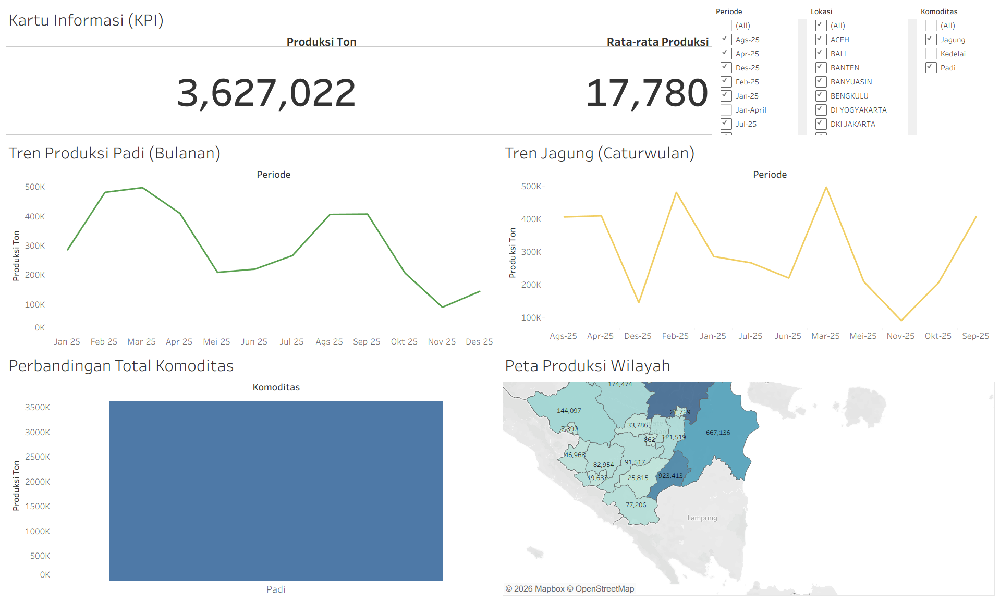

# Agricultural Production Analytics Interface (Tableau)

## 📌 Overview
An interactive Tableau analytics interface tracking agricultural crop production metrics. This personal data engineering project combines Python-based data preparation with Tableau's visualization capabilities for agricultural analytics.

## 🛠 Tech Stack
- **Language:** Tableau
- **Libraries:** Tableau Desktop, Python (data prep), Excel

## 📊 Dataset
Dataset telah melalui proses *scrambling* dan anonimisasi untuk menjaga privasi, tanpa mengubah distribusi statistik utama yang relevan dengan pemodelan.

## 🚀 Methodology
1. Raw harvest data extraction and validation
2. Python ETL pipeline for data normalization
3. Tableau calculated fields (YoY growth, production index)
4. Interactive analytics interface with geographic breakdown

## 📈 Key Results & Metrics
- 3 crop categories tracked
- 5-year production trend analysis
- Regional comparison across 12 districts

## 📁 Project Structure
```
Agricultural_Production_Dashboard/
├── README.md
├── Agricultural_Dashboard.twbx
├── ATAP JAGUNG 2024.xlsx
├── ATAP PADI 2025.xlsx
├── ATAP PADI DAN JAGUNG 2024.xlsx
├── check_totals.py
├── check_totals_2.py
├── Dashboard_Hasil_Panen_Extract.twbx
├── Database_Panen_Clean.xlsx
├── data_cleaning.py
```
