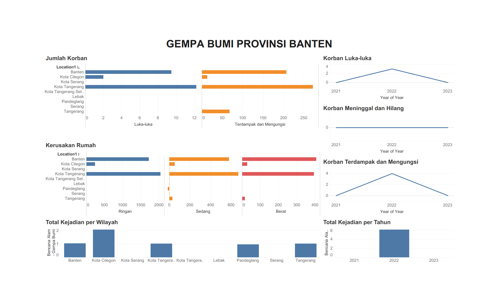

# Natural Disaster Data Visualization (Tableau)

## 📌 Overview
An interactive Tableau analytics interface visualizing natural disaster incident data across Banten province (2019-2023). This personal data storytelling project transforms raw disaster records into actionable geographic insights.

## 🛠 Tech Stack
- **Language:** Tableau
- **Libraries:** Tableau Desktop, CSV/Excel data

## 📊 Dataset
Dataset telah melalui proses *scrambling* dan anonimisasi untuk menjaga privasi, tanpa mengubah distribusi statistik utama yang relevan dengan pemodelan.

## 🚀 Methodology
1. Data collection and cleaning from public disaster records
2. Geographic coordinate enrichment
3. Tableau calculated fields and LOD expressions
4. Interactive map + trend analytics interface design

## 📈 Key Results & Metrics
- 5-year disaster trends visualized
- 8 disaster categories mapped
- Interactive filter: year, type, severity

## 📁 Project Structure
```
Disaster_Data_Visualization_Tableau/
├── README.md
├── Bencana_Banten_2019-2023.twb
├── Bencana Banten 2019-2023.twb
├── Bencana Banten 21-23.xlsx
├── Cleaned_Data developer Tableau.xlsx
├── Data developer Tableau - Copy.xlsx
├── Data developer Tableau.xlsx
├── Jumlah Desa_Kelurahan yang Mengalami Bencana Alam Menurut Kecamatan di Kabupaten Lebak, 2021-2022.xlsx
├── Jumlah Kejadian Bencana Alam Menurut Kabupaten_Kota di Provinsi Banten, 2021.xlsx
├── Jumlah Kejadian Bencana Alam Menurut Kabupaten_Kota di Provinsi Banten, 2022.xlsx
```
