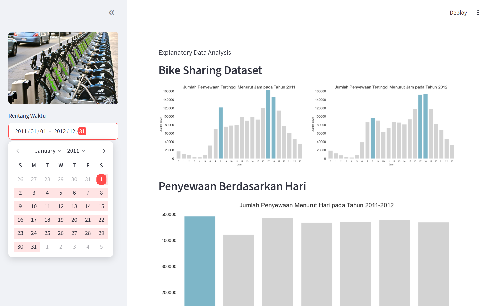

# Bike Sharing

## 📌 Overview
A personal data science research project exploring analytical methods and machine learning techniques on real-world datasets.

## 🛠 Tech Stack
- **Language:** Python / R
- **Libraries:** Pandas, Scikit-learn, Matplotlib, NumPy

## 📊 Dataset
Dataset telah melalui proses *scrambling* dan anonimisasi untuk menjaga privasi, tanpa mengubah distribusi statistik utama yang relevan dengan pemodelan.

## 🚀 Methodology
1. Exploratory Data Analysis (EDA) & Data Cleaning
2. Feature Engineering & Selection
3. Model Training & Evaluation

## 📈 Key Results & Metrics
- Accuracy: See notebook for detailed results
