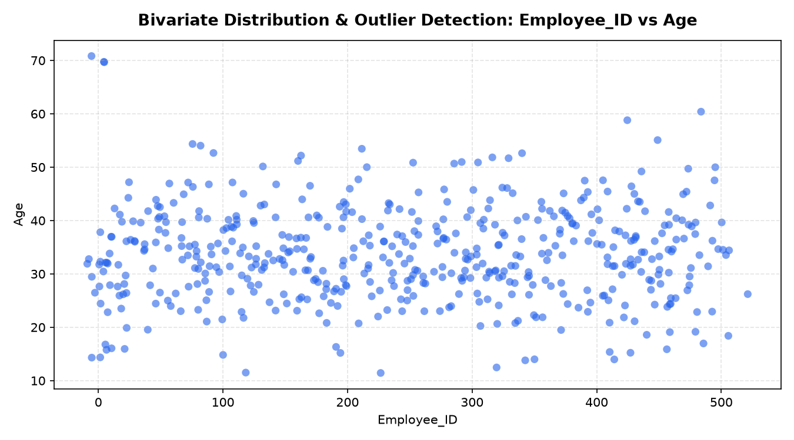

# 📊 Enterprise Workforce Analytics: Advanced Descriptive Statistics, Normality Audits & Association Matrices

## 📖 Overview & Human Capital Management Impact
In enterprise Human Capital Management (HCM) and workforce planning, data-driven decisions concerning compensation adjustments, promotion eligibility, and retention risk require rigorous statistical auditing. Deploying predictive models on raw personnel data without evaluating underlying distributional skewness, severe outliers, and non-linear associations inevitably leads to biased compensation algorithms and flawed workforce forecasts.

This project delivers a modular, reusable **Exploratory Data Analysis (EDA) and Statistical Auditing Framework** implemented in **Python/Jupyter**. Evaluating an enterprise personnel cohort (`employee_raw_dataset.csv`), the framework implements custom statistical inspection engines that extend standard automated summaries with higher-order moments (skewness, kurtosis), parametric normality tests, non-linear rank correlations, and categorical association matrices.

---

## 🛠️ Architecture & Technology Stack
- **Computational Environment**: Python 3, Jupyter Notebook (`descriptive_statistics_eda.ipynb`).
- **Core Statistical Computing**: SciPy (`scipy.stats`), NumPy, Pandas.
- **Visual Diagnostics**: Matplotlib, Seaborn.
- **Analyzed Data Schema**: Enterprise employee records (`employee_raw_dataset.csv`) comprising age, tenure, monthly salary, training hours, completed projects, promotion history, and attendance records.

---

## 🔄 Methodology & Statistical Architecture

```
Raw Personnel Census Records (employee_raw_dataset.csv)
                           │
                           ▼
     Advanced Statistical Profiling Functions
     ├── Numerical Moments: Variance, Skewness, Kurtosis
     ├── Outlier Auditing: Interquartile Range (IQR) Fences
     └── Missing Value Audit & Zero-Variance Elimination
                           │
                           ▼
     Hypothesis & Association Testing Engine
     ├── Normality Verification (Shapiro-Wilk / D'Agostino)
     ├── Monotonic Rank Dynamics: Spearman Correlation
     ├── Continuous-Binary Links: Point-Biserial Correlation
     └── Categorical Cross-Associations: Cramér's V Matrix
                           │
                           ▼
     Actionable HCM Visual Analytics & Diagnostics
```

---

## 📊 Key Statistical Implementations & Analytical Insights

### 1. Extended Moment Summarization
Standard Pandas `describe()` omits distribution shape metrics. The custom inspection engine computes:
- **Skewness & Kurtosis**: Isolates heavy positive skew in `Monthly_Salary` and identifies leptokurtic distributions in `Training_Hours`.
- **IQR Boundary Filtering**: Flags executive compensation outliers that would distort ordinary least squares models without robust winsorization.

### 2. Multi-Type Association Matrix Suite
- **Spearman Rank Correlation**: Evaluates monotonic non-linear dependencies across ordinal performance scores, attendance rates, and completed deliverables.
- **Point-Biserial Correlation ($r_{pb}$)**: Formulated between binary promotional history (`Promotion_Last_3Y`) and continuous compensation (`Monthly_Salary`), verifying significant compensation premiums tied to recent promotions.
- **Cramér's V Categorical Matrix**: Constructs an all-to-all association heatmap for nominal variables (Department, Education Level, Job Role) derived from Chi-Square ($\chi^2$) contingency statistics:
  $$V = \sqrt{\frac{\chi^2}{n \cdot \min(r - 1, k - 1)}}$$

---

## 🚀 How to Run & Reproduce

### 1. Requirements
```bash
pip install pandas numpy scipy matplotlib seaborn jupyter
```

### 2. Execute Statistical Notebook
```bash
jupyter notebook descriptive_statistics_eda.ipynb
```
Running all cells executes data profiling, generates custom statistical diagnostic tables, and plots bivariate distribution scatter plots and correlation heatmaps.

---

## 🖼️ Bivariate Distribution & Outlier Diagnostics

