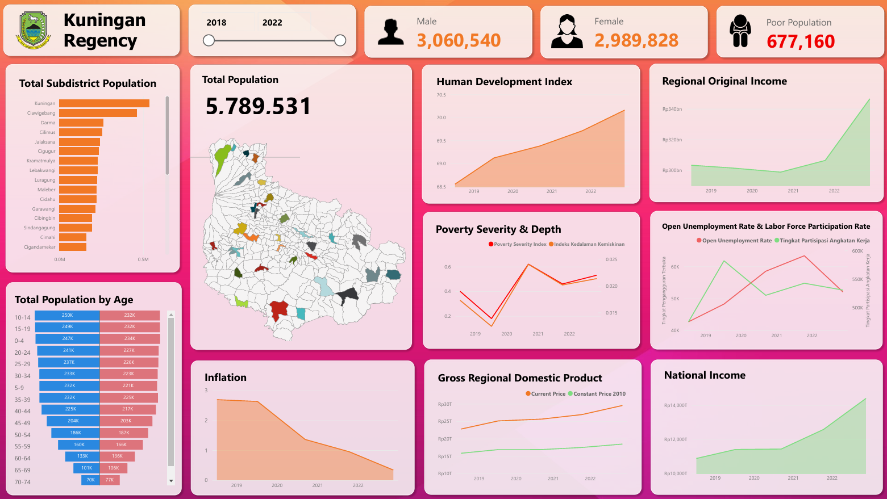

# 👥 Kuningan Regency Demographic Dynamics & Vital Statistics: Power BI Executive Dashboard

## 📖 Overview & Municipal Governance Impact
Municipal public administration, regional development planning (**Bappeda**), school zoning, and public health clinic allocation require granular demographic intelligence. Kuningan Regency (*Kabupaten Kuningan*, West Java, Indonesia) comprises dozens of administrative sub-districts (*kecamatan*) exhibiting wide variations in population density, dependency burdens, and economic migration trends.

This project delivers an interactive **Power BI Executive Analytics Dashboard** (`kuningan_population_dashboard.pbix`) that models regional population censuses and civil registry vital statistics. The system equips civic planners and policymakers with multi-dimensional visual tools to analyze age-sex cohort structures, calculate dependency ratios, map sub-district urbanization densities, and track longitudinal demographic shifts.

---

## 🛠️ Architecture & Technology Stack
- **Business Intelligence Platform**: Microsoft Power BI Desktop (`kuningan_population_dashboard.pbix`).
- **Data Modeling Engine**: Star Schema architecture linking geographic sub-district dimension tables with demographic census fact tables.
- **Analytical Formulas (DAX)**:
  - **Sex Ratio**: $\text{SR} = \left(\frac{\text{Total Male Population}}{\text{Total Female Population}}\right) \times 100$
  - **Age Dependency Ratio**: $\text{DR} = \left(\frac{\text{Pop}_{0-14} + \text{Pop}_{65+}}{\text{Pop}_{15-64}}\right) \times 100$
  - **Territorial Population Density**: $\text{Persons} / \text{km}^2$ per administrative boundary.
- **Visual Design Suite**: Coordinated population pyramid visuals, choropleth density rankings, KPI performance cards, and hierarchy slicers.

---

## 🔄 Methodology & Data Pipeline

```
Civil Registration & Regional Census Data
                   │
                   ▼
  Power Query Transformation (M Engine)
  ├── Unpivoted Age Bands & Normalized Classifications
  ├── Standardized Sub-District Administrative Identifiers
  └── Cleaned Demographic Fact & Dimension Relational Tables
                   │
                   ▼
  Star Schema Analytical Data Model
                   │
                   ▼
  DAX Calculation Layer (Ratios, Densities, Growth Trajectories)
                   │
                   ▼
  Interactive Multi-Page Executive Dashboard
  ├── High-Level Demographic KPI Cards
  ├── Bi-directional Age-Sex Population Pyramid
  └── District-by-District Density Rankings & Slicers
```

---

## 📊 Key Dashboard Features & Demographic Insights
- **Age-Sex Population Pyramid**: Visualizes expanding working-age cohorts (ages 15–64) versus child and elderly demographics, quantifying the emergence of the regional **demographic bonus** (*bonus demografi*) and pinpointing future job market demand.
- **Territorial Density Disparities**: Highlights severe population clustering within the urban Kuningan central corridor and northern transit sub-districts, contrasted with lower densities in southern agrarian highlands.
- **Interactive Multi-Level Drilldown**: Planners can toggle cross-filtering across individual sub-districts to inspect localized gender balances, age distributions, and dependency burdens.

---

## 🚀 How to Run & Explore

### 1. Requirements
Download and install [Microsoft Power BI Desktop](https://powerbi.microsoft.com/desktop/) (free for Windows).

### 2. Launch Report
Double-click `kuningan_population_dashboard.pbix` to open the full interactive report canvas. Interact with demographic filters, click individual district bars to cross-highlight the population pyramid, and explore demographic KPI cards.

---

## 🖼️ Dashboard Interface & Demographic Pyramid

