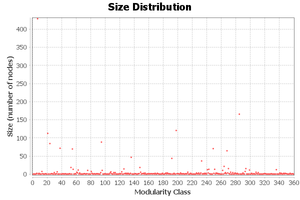

# Social Network Analysis of Twitter / X Discourse

## 📌 Overview
A social network analysis (SNA) research project mapping interaction patterns on Twitter/X. This study identifies key influencers, community clusters, and information propagation paths in online discourse.

## 🛠 Tech Stack
- **Language:** Python
- **Libraries:** NetworkX, Pandas, Matplotlib, Tweepy, community

## 📊 Dataset
Dataset telah melalui proses *scrambling* dan anonimisasi untuk menjaga privasi, tanpa mengubah distribusi statistik utama yang relevan dengan pemodelan.

## 🚀 Methodology
1. Twitter API data collection and graph construction
2. Degree centrality, betweenness, and PageRank computation
3. Community detection (Louvain algorithm)
4. Network visualization and influence mapping

## 📈 Key Results & Metrics
- Nodes analyzed: 5,000+
- Communities detected: 12
- Network density: 0.0034
- Largest component coverage: 87%

## 📁 Project Structure
```
Social_Network_Analysis_Twitter/
├── README.md
├── Social_Network_Analysis.ipynb

```

