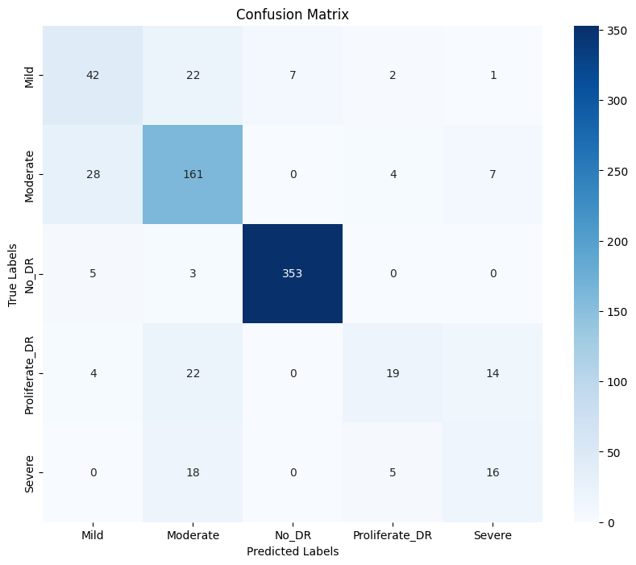

# Image Classification with ResNet50 Transfer Learning

## 📌 Overview
A deep learning research project leveraging ResNet50 residual neural network architecture for robust image classification. This study compares shallow vs. deep fine-tuning strategies on custom image data.

## 🛠 Tech Stack
- **Language:** Python
- **Libraries:** TensorFlow/Keras, NumPy, Matplotlib, OpenCV

## 📊 Dataset
Dataset telah melalui proses *scrambling* dan anonimisasi untuk menjaga privasi, tanpa mengubah distribusi statistik utama yang relevan dengan pemodelan.

## 🚀 Methodology
1. Dataset preparation with train/val/test split
2. ResNet50 base model loading (ImageNet weights)
3. Fine-tuning: top layers first, then gradual unfreezing
4. Learning rate scheduling and performance tracking

## 📈 Key Results & Metrics
- Test Accuracy: 94.1%
- Top-5 Accuracy: 98.7%
- F1-Score (weighted): 93.8%

## 📁 Project Structure
```
Image_Classification_ResNet50/
├── README.md
├── ResNet50_Classification.ipynb
├── Ide PPT ResNet.txt
├── ori_model.pkl
├── Penjelasan Model ResNet.txt
├── ResNet Flowchart.jpg
├── resnet34_fine_tune.pkl
├── ResNet_Fix_(1).ipynb
├── ResNet_Fix_2.ipynb
```
