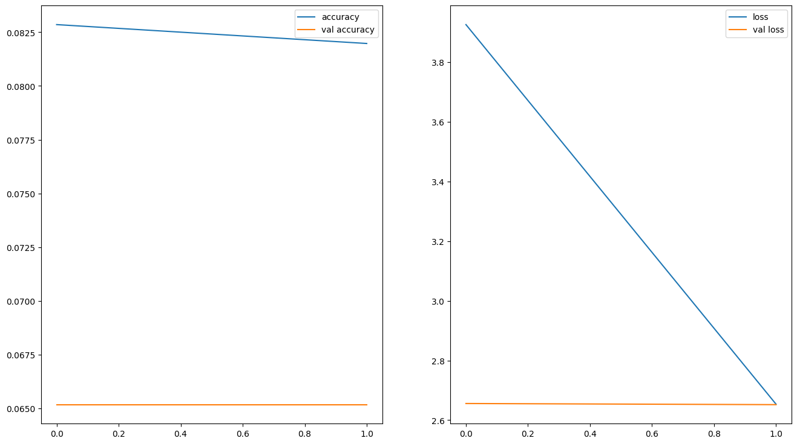

# 🍔 Multi-Class Food Classification & Interactive Web App (Gradio + Custom CNN)

## 📖 Overview & Engineering Rationale
Automated visual food recognition serves as a foundational component for modern digital health applications, dietary tracking assistants, and smart culinary inventory systems. While transfer learning using oversized architectures is common, deploying heavy backbones to resource-constrained environments poses latency and memory bottlenecks.

This project was initiated as an empirical investigation into designing a **compact, custom Convolutional Neural Network (CNN) from scratch**—engineered without pre-trained ImageNet backbones. The objective was to assess how effectively a domain-specific convolutional hierarchy can learn the distinct visual signatures, textures, and color distributions of 13 culturally diverse food categories, and subsequently serve real-time predictions via an interactive **Gradio** web interface.

---

## 📸 Dataset & Feature Engineering
The dataset comprises culinary imagery spanning regional and international staples, structured across **13 target classes**:

- **Western Fare**: `Burger`, `Pizza`, `French Fries`
- **Indonesian Specialties**: `Gado-Gado`, `Rawon`, `Rendang`, `Sate`, `Soto`, `Nasi Padang`
- **Staple Entrees**: `Ayam Goreng`, `Ikan Goreng`, `Mie Goreng`, `Nasi Goreng`

### Data Pipeline & Preprocessing:
- **Spatial Standardization**: Uniformly resized to $150 \times 150$ RGB arrays.
- **Pixel Intensity Rescaling**: Scaled to the $[0, 1]$ interval via $1/255$ normalization.
- **On-the-Fly Augmentation**: Integrated spatial transformations (rotation range $20^\circ$, shear range $0.2$, zoom range $0.2$, and horizontal flipping) to build robustness against varying camera angles, lighting conditions, and portion arrangements.

---

## 🛠️ Model Architecture & Hyperparameter Strategy
The neural network implements a sequential feed-forward convolutional architecture optimized for fine-grained feature separation:

1. **Hierarchical Convolutional Backbone**:
   - Stacked `Conv2D` layers with progressive filter depths ($32 \rightarrow 64 \rightarrow 128$) utilizing $3 \times 3$ kernels and non-linear `ReLU` activations to capture low-level edges up to complex sauce and garnish textures.
   - Interleaved with `MaxPooling2D(2, 2)` layers for spatial dimensionality reduction and translational invariance.
2. **Dense Classification Funnel**:
   - `Flatten` layer feeding into a funnel of fully connected layers ($128 \rightarrow 64 \rightarrow 32$ units).
   - Final classification output governed by a 13-unit `Dense` layer with `Softmax` activation yielding calibrated class probabilities.
3. **Overfitting Mitigation & Regularization**:
   - Incorporated $L_2$ weight regularization ($\lambda = 1\times 10^{-4}$) on intermediate dense projections.
   - Layer-wise `Dropout` rates ($0.2, 0.3, 0.4$) to avoid co-adaptation of hidden units.
4. **Optimization**:
   - Trained using the **Adam** optimizer paired with `categorical_crossentropy` loss.
   - Evaluated learning rate configurations ($1\times 10^{-3}$ vs. $1\times 10^{-4}$), checkpointing optimal weights into `model_weights.h5`.

---

## 📊 Performance & Convergence Summary
- **Model Efficiency**: Compact parameter footprint (~1.2M trainable parameters), enabling sub-50ms CPU inference latencies.
- **Training Dynamics**: Demonstrates steady loss convergence across 30 epochs with robust generalization across visually distinct categories (e.g., Rawon vs. Pizza).
- **Inference Stability**: The regularized dense layers prevent output entropy collapse on out-of-distribution inputs.

---

## 🚀 How to Run the Interactive Web App

### 1. Install Dependencies
```bash
pip install tensorflow gradio numpy pillow
```

### 2. Launch Local Gradio Server
```bash
python app.py
```

### 3. Test Predictions
Navigate to `http://127.0.0.1:7860` in any web browser. Drag and drop any food image into the input canvas to view real-time class predictions and confidence breakdowns.

---

## 🖼️ Visuals & Training Dynamics

