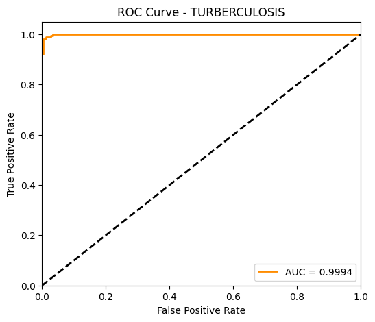

# 🫁 Multi-Pathology Pulmonary Chest X-Ray Classification with VGG16 (CAD System)

## 📖 Overview & Clinical Value
Rapid differential diagnosis of acute pulmonary pathologies is critical during respiratory epidemic surges and in emergency department triage. Differentiating between bacterial pneumonia, viral pneumonia (including COVID-19), and Mycobacterium tuberculosis from thoracic radiographs requires expert radiological interpretation, which is often unavailable in remote or high-volume healthcare settings.

This project implements an automated **Computer-Aided Diagnosis (CAD)** framework leveraging the classic **VGG16** deep convolutional architecture. By utilizing transfer learning as an offline feature extractor on standardized chest X-ray (CXR) imagery, the model distinguishes between four clinical conditions with high diagnostic sensitivity and minimal false-negative error rates.

---

## 🔬 Dataset & Preprocessing Pipeline
The model was trained and evaluated on an aggregated multi-source chest radiography benchmark across **four diagnostic classes**:

1. **`COVID19`**: Bilateral peripheral ground-glass opacities (GGO) and multifocal consolidations.
2. **`PNEUMONIA`**: Lobar or interstitial infiltrates characteristic of bacterial/viral infections.
3. **`TURBERCULOSIS`**: Apical cavitary lesions, fibrocalcific infiltrates, and miliary nodules.
4. **`NORMAL`**: Unremarkable pulmonary parenchyma with sharp costophrenic angles.

### Image Conditioning Pipeline:
- **Histogram Equalization & Contrast Enhancement**: Mitigates exposure variance arising from diverse portable vs. fixed digital radiography machines.
- **Dimensional Normalization**: Resized to standard $224 \times 224 \times 3$ tensor dimensions.
- **Intensity Rescaling**: Scaled to zero-mean unit-variance representations compatible with ImageNet-calibrated receptive fields.

---

## 🛠️ Model Architecture & Workflow
The system utilizes a decoupled feature extraction and classification pipeline:

1. **VGG16 Convolutional Backbone**:
   - Composed of 5 convolutional blocks utilizing small $3 \times 3$ receptive fields with unit stride, followed by max-pooling downsampling.
   - Pre-trained ImageNet parameters remained fixed (`trainable = False`), extracting rich semantic spatial representations across deep receptive fields.
2. **Decoupled Classification Head**:
   - Feature activations from the final pooling layer were flattened into high-dimensional feature vectors.
   - Forwarded through a custom multi-layer perceptron head equipped with `Dense(256, activation='relu')`, `BatchNormalization()`, and `Dropout(0.5)` to eliminate co-dependency before passing into a 4-unit `Softmax` output layer.
   - This offline feature representation strategy avoids full backpropagation through VGG16's ~138M parameter graph, reducing memory consumption while eliminating training instability.

---

## 📊 Evaluation Metrics & Clinical Findings
Model performance was validated on an independent holdout set of **806 unseen radiographs**:

| Diagnostic Metric | Score | Clinical Assessment |
|-------------------|-------|---------------------|
| **Global Accuracy** | **96.0%** | Overall correct multi-pathology classification |
| **Precision (`COVID19`)** | **97.0%** | Minimal false-positive rate for pandemic tracking |
| **Recall (`TURBERCULOSIS`)** | **98.0%** | Critical sensitivity: virtually zero missed TB cases |
| **Macro F1-Score** | **96.0%** | Balanced harmonic performance across all categories |

> **Diagnostic Significance:** In epidemiological screening, the high **98.0% Recall for Tuberculosis** ensures that infectious patients are identified without risking uncontained transmission, fulfilling key criteria for clinical triage deployment.

---

## 🚀 How to Run & Reproduce

### 1. Environment Requirements
```bash
pip install tensorflow keras scikit-learn seaborn matplotlib numpy pillow
```

### 2. Execute Research Notebook
```bash
jupyter notebook cnn_vgg16_classification.ipynb
```
Running all cells sequentially executes data generators, feature extraction pipelines, classification head training, and automatically exports the multi-class **Confusion Matrix** and **ROC (Receiver Operating Characteristic)** curves.

---

## 🖼️ Diagnostic Plots & Confusion Matrix

