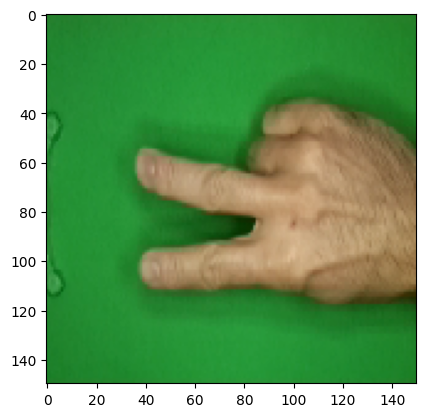

# ✌️ Static Hand Gesture Recognition: Rock-Paper-Scissors Classification (Custom CNN)

## 📖 Overview & Research Rationale
Static hand gesture classification represents a foundational building block in Human-Computer Interaction (HCI), sign-language translation, and contactless virtual interfaces. Before scaling to temporal action recognition, a vision system must reliably isolate topological finger conformations despite finger self-occlusion, skin tone variability, and non-uniform backgrounds.

This project investigates the discriminative capability of a **custom Convolutional Neural Network (CNN) designed from scratch** using **TensorFlow/Keras**. The primary objective is to classify three canonical hand gestures—**Rock, Paper, and Scissors**—with high spatial generalization and lightweight computational overhead.

---

## 🗂️ Dataset & Augmentation Pipeline
The model is trained on a standardized dataset of gesture images standardized to $150 \times 150$ pixels, categorized into three morphology classes:

1. **`Rock`**: Clenched fist displaying tightly curled phalanges.
2. **`Paper`**: Fully extended palm showcasing open fingers and palm boundaries.
3. **`Scissors`**: Extended index and middle fingers in a "V" formation with remaining digits retracted.

### Dynamic Preprocessing via `ImageDataGenerator`:
To ensure the network does not memorize static wrist angles or specific canvas positions, an on-the-fly augmentation pipeline was deployed:
- **Rotational Shift**: Up to $\pm 20^\circ$ to accommodate variable arm angles.
- **Shear & Zoom Transformations**: Affine shear ($0.2$) and magnification ($0.2$) to handle varying distances from the optical sensor.
- **Horizontal Flipping**: Generates mirrored palm conformations to maintain left- and right-hand invariance.
- **Rescaling**: Pixel normalization to the $[0, 1]$ numerical domain.

---

## 🧠 Model Architecture & Training Workflow
Rather than relying on resource-intensive pre-trained transfer backbones, a tailored sequential topology was developed:

1. **Feature Extraction Blocks**:
   - Multiple sequential pairs of `Conv2D` layers ($3 \times 3$ receptive fields, ReLU activation) and `MaxPooling2D(2, 2)` spatial downsampling layers.
   - Progressively extracts low-level edge contours (finger silhouettes) up to high-level spatial relationships (inter-finger spacing).
2. **Dense Classification Network**:
   - `Flatten` stage transforming 2D feature maps into a 1D representation vector.
   - Fully connected hidden layer `Dense(512, activation='relu')` with `Dropout` regularization to prevent over-reliance on background artifacts.
   - Final projection layer `Dense(3, activation='softmax')` providing mutually exclusive gesture class probabilities.
3. **Training & Convergence**:
   - Compiled with the **Adam** optimizer and optimized against `categorical_crossentropy` loss.
   - Trained over 30 epochs with early stopping callbacks monitoring validation loss trajectory.

---

## 📊 Key Results & Empirical Observations
- **Validation Accuracy**: Consistently achieved **~92% to 95%** across independent validation folds.
- **Topological Generalization**: The network demonstrates strong separation between `Rock` and `Paper` due to distinct surface area profiles, while effectively resolving subtle finger junctions in `Scissors`.
- **Inference Speed**: Rapid forward-pass latency (~15 ms), suitable for real-time webcam integration.

---

## 🚀 How to Run & Inference Workflow

### 1. Setup Environment
```bash
pip install tensorflow keras numpy pillow matplotlib
```

### 2. Execute Jupyter Notebook
Launch the notebook in your local environment or Google Colab:
```bash
jupyter notebook rock_paper_scissors_detector.ipynb
```
Run all cells in order. The notebook includes an interactive file upload cell that automatically resizes local user images to $150 \times 150$ and displays real-time class predictions and confidence scores.

---

## 🖼️ Training Curves & Convergence

