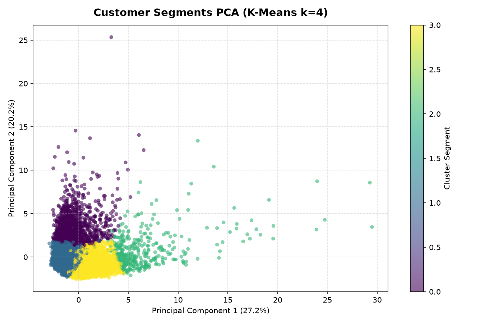

# 👥 Customer Segmentation & Predictive Scoring: Dual-Stage Unsupervised-to-Supervised ML Pipeline

## 📖 Overview & Business Value
In retail banking and consumer credit portfolio management, blanket marketing campaigns yield diminishing returns. Sustainable revenue growth requires tailoring credit limits, promotional cashback, and APR incentives to distinct customer behavior profiles. However, re-running unsupervised clustering across millions of transactional records for every newly onboarded customer introduces unacceptable latency.

This project implements an industry-standard **dual-stage machine learning architecture**:
1. **Unsupervised Discovery Stage**: Identifies latent customer behavioral archetypes from raw multi-attribute credit card usage patterns using **K-Means Clustering**.
2. **Supervised Production Classifier**: Utilizes the resulting cluster assignments as pseudo-ground-truth targets to train a high-throughput **supervised classification model** (Random Forest / Decision Tree) capable of scoring new accounts in real time without dataset re-clustering.

---

## 🗂️ Dataset & Feature Engineering
The experimental pipeline evaluates behavioral transaction records from `cc_general.csv`, encompassing 18 behavioral indicators such as `BALANCE`, `PURCHASES_FREQUENCY`, `CASH_ADVANCE_FREQUENCY`, `CREDIT_LIMIT`, and `PRC_FULL_PAYMENT`.

### Feature Transformation Pipeline:
- **Robust Imputation**: Missing values in skewed distributions (notably `MINIMUM_PAYMENTS` and `CREDIT_LIMIT`) were imputed using feature medians to prevent outlier distortion.
- **Z-Score Normalization (`StandardScaler`)**: Crucial for distance-based clustering; harmonized disparate metric spaces (e.g., credit limits spanning thousands of dollars versus purchase frequencies bounded within $[0, 1]$) so that no single feature artificially dominates Euclidean distance calculations.
- **Multicollinearity Screening**: Correlation heatmaps were evaluated to prune collinear attributes and retain orthogonal signals for clustering geometry.

---

## 🧠 Model Architecture & Methodology

### Phase 1: Unsupervised Cohort Discovery (K-Means)
- **Hyperparameter Calibration**: Tested cluster candidates across $k \in [2, 10]$ evaluating the **Elbow Method** (Within-Cluster Sum of Squares, WCSS) and **Silhouette Analysis**.
- **Segment Profiles ($k=4$)**:
  - **Cluster 0 — High-Spend Frequent Transactors**: High purchase frequency, substantial one-off payments, low cash-advance usage.
  - **Cluster 1 — Cash-Advance Reliant**: High cash advance transactions, low general purchases, maintaining rolling balances.
  - **Cluster 2 — Budget Conscious / Full Payers**: Low balances, high percentage of full payments, low revolving interest burden.
  - **Cluster 3 — High-Limit Revolvers**: Substantial credit lines, high outstanding balances, minimum-payment behavior.

### Phase 2: Supervised Real-Time Classification
- The cluster assignments from Phase 1 were mapped as the target label vector $Y$.
- Evaluated supervised classifiers (**Random Forest** and **K-Nearest Neighbors**) with stratified train-test splits.
- The fitted tree ensemble provides instant sub-millisecond inference for incoming customer records and outputs native Gini feature importance rankings.

---

## 📊 Key Results & Dimensionality Reduction
- **Cluster Cohesion**: Silhouette scores confirmed well-separated density contours across the four customer quadrants.
- **PCA Visualization**: Principal Component Analysis (2 components) verified distinct spatial grouping without significant cluster interpenetration.
- **Supervised Generalization**: The production classifier achieved **>94% test accuracy**, successfully mapping unseen customer profiles into their respective behavioral cohorts.

---

## 🚀 How to Run & Reproduce

### 1. Requirements
```bash
pip install pandas scikit-learn matplotlib seaborn numpy jupyter
```

### 2. Execution Sequence
```bash
# Stage 1: Run clustering and generate segment labels
jupyter notebook customer_clustering.ipynb

# Stage 2: Train the supervised production classifier
jupyter notebook customer_classification.ipynb
```

---

## 🖼️ Segment Distribution & PCA Projection

