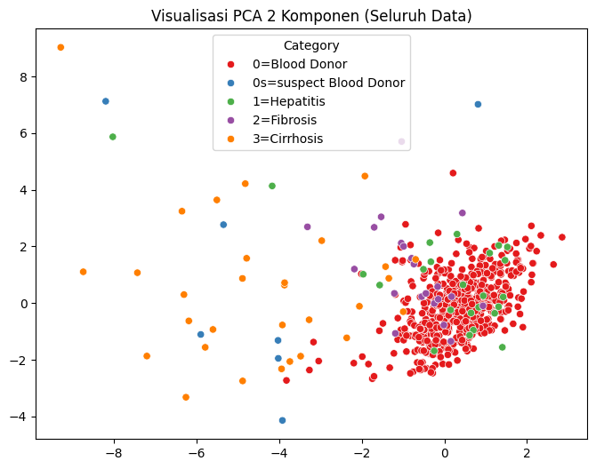

# 🧬 Clinical Decision Support: Hepatitis C Staging with Naive Bayes & PCA

## 📖 Overview & Clinical Value
Hepatitis C is a blood-borne viral infection that induces progressive necroinflammatory liver injury, frequently culminating in fibrosis, cirrhosis, and hepatocellular carcinoma if left untreated. In routine clinical workflows, evaluating liver function involves synthesizing complex panels of hepatic enzymes, proteins, and metabolic markers.

This research project develops a machine learning-driven **Clinical Decision Support System (CDSS)** to evaluate whether a probabilistic Bayesian framework can accurately categorize disease progression stages directly from routine blood laboratory panels. Furthermore, the project investigates the diagnostic impact of **Principal Component Analysis (PCA)** in reducing multivariate biomarker spaces into interpretable low-dimensional representations for clinical visualization.

---

## 🩺 Dataset & Laboratory Biomarker Panel
The study utilizes the clinical cohort from `hepatitis_c_data.csv`, comprising biochemical serum measurements mapped across five diagnostic categories: *Healthy Blood Donors*, *Suspect Blood Donors*, *Hepatitis*, *Fibrosis*, and *Cirrhosis*.

### Predictor Biomarker Attributes:
| Biomarker | Full Biochemical Name | Physiological Relevance |
|-----------|----------------------|-------------------------|
| `ALB` | Albumin (g/dL) | Hepatic synthetic capacity |
| `ALP` | Alkaline Phosphatase | Biliary tract integrity & bone turnover |
| `ALT` | Alanine Transaminase (SGPT) | Hepatocellular injury indicator |
| `AST` | Aspartate Transaminase (SGOT) | Mitochondrial liver damage marker |
| `BIL` | Total Bilirubin | Hemoglobin breakdown & biliary excretion |
| `CHE` | Cholinesterase | Liver parenchymal reserve status |
| `CHOL` | Total Cholesterol | Hepatic lipid synthesis |
| `CREA` | Serum Creatinine | Renal function monitoring |
| `GGT` | Gamma-Glutamyl Transferase | Sensitive biliary & alcohol toxicity indicator |
| `PROT` | Total Serum Protein | Overall oncotic pressure & protein metabolism |

### Feature Transformation Pipeline:
- **Encoding**: Binary mapping for demographic covariates (`Sex`: $0 = \text{Male}, 1 = \text{Female}$).
- **Z-Score Normalization**: Standardized through `StandardScaler` to ensure balanced variance weighting prior to eigendecomposition in PCA.
- **Dimensionality Reduction**: Extracted the top 2 orthogonal eigenvectors capturing the primary axis of pathological variance.

---

## 🧠 Model Architecture & Pipeline Comparison
The investigation systematically evaluates two parallel machine learning pipelines:

1. **Full-Spectrum Baseline (`pipe_nb`)**:
   - Gaussian Naive Bayes fitted across all 12 original biochemical and demographic dimensions.
   - Leverages Bayes' theorem with Gaussian likelihood assumptions, offering rapid inference and calibrated posterior class probabilities.
2. **Dimensionally-Reduced Pipeline (`pipe_pca_nb`)**:
   - `StandardScaler` $\rightarrow$ `PCA(n_components=2)` $\rightarrow$ `GaussianNB()`.
   - Projects patient coordinates onto a 2D clinical map, providing physicians with visual intuitions of disease severity boundaries.

---

## 📊 Diagnostic Findings & Inference

```python
import pandas as pd

# Diagnostic inference on a 45-year-old male presenting abnormal transaminases
patient_profile = {
    "Age": 45, "Sex": 0, "ALB": 38.5, "ALP": 68.0,
    "ALT": 85.0, "AST": 110.0, "BIL": 14.5, "CHE": 5.8,
    "CHOL": 3.9, "CREA": 92.0, "GGT": 145.0, "PROT": 68.0
}

predicted_stage = pipe_nb.predict(pd.DataFrame([patient_profile]))
posterior_probs = pipe_nb.predict_proba(pd.DataFrame([patient_profile]))

print(f"Predicted Diagnosis   : {predicted_stage[0]}")
print(f"Diagnostic Confidence : {max(posterior_probs[0]):.2%}")
```

### Clinical Insights:
- Principal Component 1 is strongly weighted by elevated transaminases (`AST`, `ALT`) and `GGT`, effectively separating active hepatitis and end-stage cirrhosis from normal blood donor baselines.
- The probabilistic outputs provide clinicians with calibrated risk confidence scores, highlighting ambiguous transition boundaries between fibrosis and early cirrhosis.

---

## 🚀 How to Run & Reproduce

### 1. Requirements
```bash
pip install pandas scikit-learn matplotlib seaborn numpy jupyter
```

### 2. Run Notebook
```bash
jupyter notebook hepatitis_c_prediction.ipynb
```

---

## 🖼️ PCA Projections & Biomarker Correlation Heatmap

