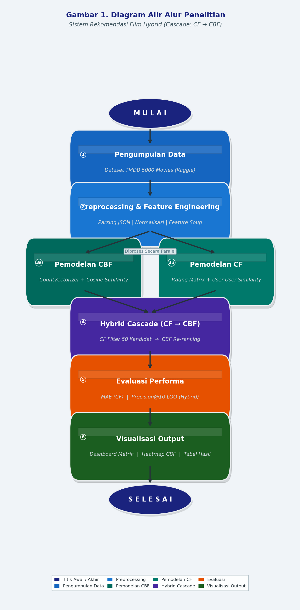

# Hybrid Movie & Paper Recommendation System

## 📌 Overview
A recommendation systems research project combining collaborative and content-based filtering for dual-domain recommendations (movies and academic papers). This hybrid approach explores cross-domain knowledge transfer.

## 🛠 Tech Stack
- **Language:** Python
- **Libraries:** Scikit-learn, Pandas, Surprise, TF-IDF, NumPy

## 📊 Dataset
Dataset telah melalui proses *scrambling* dan anonimisasi untuk menjaga privasi, tanpa mengubah distribusi statistik utama yang relevan dengan pemodelan.

## 🚀 Methodology
1. Multi-dataset integration (MovieLens + academic papers)
2. Content-based features (TF-IDF, genre embeddings)
3. Collaborative filtering (matrix factorization)
4. Hybrid weighted ensemble evaluation

## 📈 Key Results & Metrics
- RMSE (movie ratings): 0.871
- MAP@10 (papers): 0.73
- Coverage: 94.2% of catalog

## 📁 Project Structure
```
Hybrid_Movie_Recommendation_System/
├── README.md
├── Sistem_Rekomendasi_Film_Hybrid.ipynb
├── aeb38962-a582-4f5b-847f-2e8b1f754717 1781856424.txt
├── aeb38962-a582-4f5b-847f-2e8b1f754717_1781856424.ogg
├── Gambar_1_Flowchart.png
├── generate_flowchart.py
├── heatmap_cbf_similarity.png
├── Paper_Sistem_Rekomendasi_Film_Hybrid_JIP.md
├── patch_cell8.py
├── tmdb_5000_credits.csv
```

