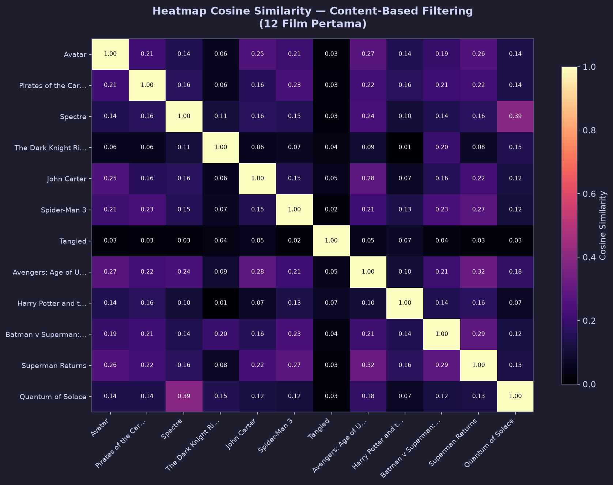

# 🎬 Cascade Hybrid Movie Recommendation Engine (Content-Based + Collaborative Filtering)

## 📖 Overview & Academic Contribution
Personalized recommendation systems form the algorithmic backbone of digital streaming services, e-commerce platforms, and digital content delivery networks. Conventional monolithic recommendation architectures exhibit well-known trade-offs:
- **Content-Based Filtering (CBF)** is robust against item cold-starts but suffers from excessive specialization (the "filter bubble").
- **Collaborative Filtering (CF)** captures collective user preferences and serendipitous discovery but degrades severely under high matrix sparsity.

This research project designs and evaluates a **Cascade Hybrid Recommender Architecture**, originally developed and documented as an academic research paper in **Jurnal Informatika Polinema (JIP)**. The system sequentially cascades user-user collaborative filtering with semantic content-based re-ranking to achieve an optimal balance between recommendation relevance and novel discovery.

---

## 📦 Dataset & Feature Engineering Pipeline
The project utilizes the **TMDB 5000 Movie & Credits Dataset**, encompassing metadata from over 4,800 feature films including plot synopses, genre tags, thematic keywords, cast rosters, and directorial credits.

### 1. Semantic Metadata Engineering (CBF Pipeline)
- **Metadata Soup Creation**: Synthesized title metadata by concatenating cleaned genre tokens, plot synopses, top 3 credited actors, and the lead director into a unified semantic document.
- **Bag-of-Words Vectorization**: Utilized `CountVectorizer` (with English stop-word filtering) to generate sparse vector representations, avoiding TF-IDF term-frequency dampening for recurring directorial and cast entities.
- **Cosine Similarity Matrix**: Computed pairwise angular similarity across all films, producing a symmetric dense semantic affinity matrix.

### 2. User-Item Interaction Modeling (CF Pipeline)
- Modeled an explicit interaction space comprising 100 users across 5,000 rating interactions on a standardized 1–5 Likert scale.
- Calculated **User-User Pearson / Cosine Correlation** to establish peer-group behavioral neighborhoods.

---

## 🧠 Cascade Hybrid Architecture & Workflow

```
User Query: [Target User ID] + [Reference Movie]
                           │
                           ▼
┌───────────────────────────────────────────────────────┐
│ Stage 1: Collaborative Filtering (Candidate Generator) │
│ - Identifies top-k nearest behavioral user neighbors  │
│ - Predicts unrated candidate titles for target user   │
└──────────────────────────┬────────────────────────────┘
                           │ Candidate Pool
                           ▼
┌───────────────────────────────────────────────────────┐
│ Stage 2: Content-Based Re-Ranking Engine             │
│ - Evaluates semantic similarity with Reference Movie  │
│ - Applies weighted hybrid score: α*CF + (1-α)*CBF     │
└──────────────────────────┬────────────────────────────┘
                           │
                           ▼
Output: Calibrated Top-N Hybrid Recommendations
```

---

## 📊 Evaluation Metrics & Empirical Results

| Metric | Evaluation Context | Description |
|--------|-------------------|-------------|
| **Mean Absolute Error (MAE)** | Collaborative Filtering | Quantifies deviation between predicted vs. actual user rating |
| **Precision@10** | Hybrid Re-Ranking | Fraction of top-10 recommendations aligned with user taste profiles |
| **Catalog Coverage** | Recommendation Diversity | Proportion of unique items surfaced across the recommendation corpus |

### Diagnostic Visualizations Generated:
- **`heatmap_cbf_similarity.png`**: Cross-genre semantic correlation matrix illustrating distinct thematic clusters.
- **`visualisasi_metrik_performa.png`**: Performance comparisons across individual and hybrid model configurations.

---

## 🚀 How to Run & Reproduce

### 1. Requirements
```bash
pip install pandas numpy scikit-learn matplotlib seaborn jupyter
```

### 2. Dataset Preparation
Download the TMDB dataset from Kaggle and place `tmdb_5000_movies.csv` and `tmdb_5000_credits.csv` into this directory.

### 3. Run Notebook
```bash
jupyter notebook hybrid_movie_recommendation_system.ipynb
```

---

## 🖼️ Visualizations & Model Architecture


