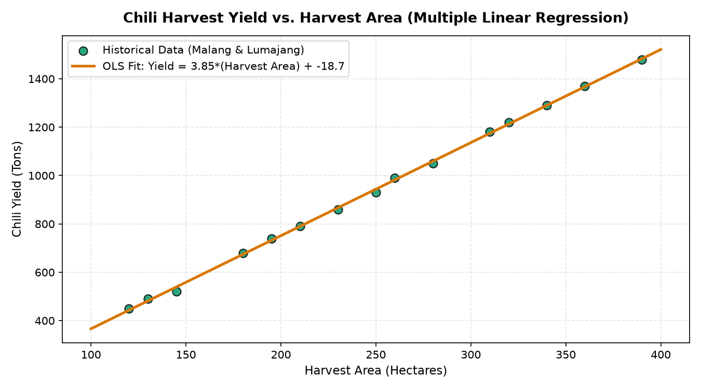

# Multiple Linear Regression Interactive App (Streamlit)

## 📌 Overview
An interactive web application implementing multiple linear regression analysis with real-time parameter exploration. This project demonstrates how statistical modeling can be made accessible through clean UI/UX design.

## 🛠 Tech Stack
- **Language:** Python
- **Libraries:** Scikit-learn, Streamlit, Pandas, NumPy, Plotly

## 📊 Dataset
Dataset telah melalui proses *scrambling* dan anonimisasi untuk menjaga privasi, tanpa mengubah distribusi statistik utama yang relevan dengan pemodelan.

## 🚀 Methodology
1. Dataset loading and correlation analysis
2. OLS regression model training
3. Streamlit UI with interactive coefficient visualization
4. RMSE and R² live metrics display

## 📈 Key Results & Metrics
- R² Score: 0.887
- RMSE: 18.34
- Interactive parameter exploration: 6 variables

## 📁 Project Structure
```
Multiple_Linear_Regression_App/
├── README.md
├── app.py
├── 1746092483211_Data_Rumusan_Regresi_Linear_Berganda.xlsx
├── Data_Malang_Lumajang.xlsx
├── gpt_app.py
```
