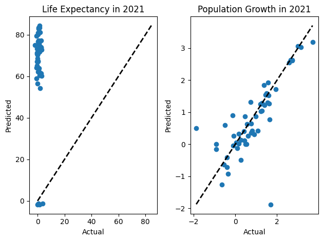

# 🌍 Global Demographic Trajectory Modeling: Multivariate Regression for Population Growth & Life Expectancy

## 📖 Overview & Macroeconomic Significance
Demographic transition patterns—characterized by declining total fertility rates, rapid population aging, and changing epidemiological profiles—represent structural shifts that fundamentally impact labor supply, pension sustainability, and public healthcare capacity. Accurately projecting demographic milestones allows international development agencies and governments to formulate resilient social infrastructure policies.

This research project investigates the multivariate relationships driving global demographic trajectories, addressing the core empirical inquiry: **"To what degree can national-level population growth rates and life expectancy milestones in 2021 be modeled from multi-decade historical indicators compiled across global statistical databases?"**

---

## 📦 Dataset & Demographic Indicators
The empirical dataset compiles cross-national longitudinal records sourced from the **United Nations Population Division** and the **World Bank Development Indicators**:

| Demographic Feature | Indicator Definition | Unit of Measure |
|---------------------|----------------------|-----------------|
| `Population Growth` | Annual percentage growth rate | % per annum |
| `Life Expectancy` | Life expectancy at birth | Years |
| `Fertility Rate` | Total births per reproductive woman | Children per woman |
| `Death Rate` | Crude mortality rate | Deaths per 1,000 people |
| `Birth Rate` | Crude natality rate | Births per 1,000 people |
| `Median Age` | Demographic median age of the nation | Years |

### Preprocessing & Statistical Sanitization:
- **Interquartile Range (IQR) Outlier Mitigation**: Filtered anomalous reporting artifacts in micro-state observations without distorting broader geopolitical trends.
- **Leakage-Free Train-Test Partitioning**: Partitioned training data and strictly reserved terminal 2021 observations as an unseen holdout benchmark.
- **Multivariate Standardization**: Scaled indicator features to zero-mean unit-variance to ensure balanced optimization gradients.

---

## 🧠 Dual Parallel Regression Architecture
Rather than employing a single coupled model, the framework deploys two specialized, independent regression pipelines:

1. **Life Expectancy Estimator**:
   - Models `Life Expectancy` as a dependent function of mortality trends, demographic aging profiles, and long-term socio-health indicators.
   - Evaluated using **Root Mean Squared Error (RMSE)** and **$R^2$ Score**.
2. **Population Growth Forecasting Engine**:
   - Predicts `Population Growth` using non-linear interactions between fertility rates, net crude rate differentials, and age demographics.
   - Evaluated via independent predictive validation metrics (`RMSE Pop`, $R^2$ Pop).

---

## 📊 Key Results & Empirical Findings
- **High Predictive Fidelity for Life Expectancy ($R^2 > 0.88$)**: Demonstrates strong structural path dependence, confirming that national life expectancy advances steadily with medical infrastructure and sanitation improvements.
- **Population Growth Variance**: While fertility rate remains the primary long-term anchor, annual growth rate predictions capture greater residual variance due to exogenous geopolitical events and cross-border net migration.

---

## 🚀 How to Run & Reproduce

### 1. Requirements
```bash
pip install pandas numpy scikit-learn matplotlib seaborn jupyter
```

### 2. Execute Research Notebook
```bash
jupyter notebook population_growth_prediction.ipynb
```

---

## 🖼️ Demographic Trends & Regression Trajectories

