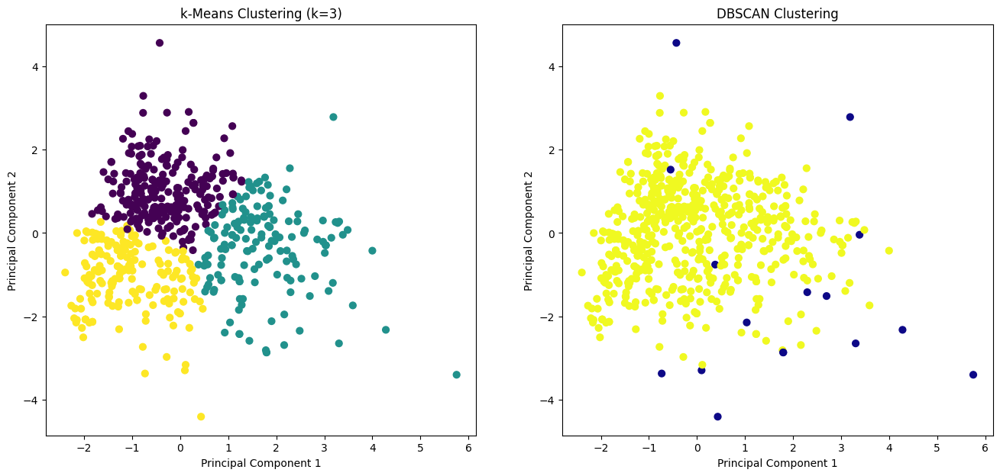

# 🔬 Applied Data Science Benchmark: Comparative Evaluation of Regression, Classification, and Clustering

## 📖 Overview & Methodological Value
In applied machine learning engineering, model selection must be driven by rigorous empirical benchmarking rather than algorithmic dogma. Different families of algorithms carry distinct inductive biases regarding linearity, feature scale sensitivity, and spatial topology.

This project provides a comprehensive, head-to-head comparative benchmark across the three foundational pillars of modern machine learning: **Continuous Regression**, **Supervised Classification**, and **Unsupervised Clustering**, systematically evaluated on a standardized multi-attribute dataset (`A2data.csv`).

---

## 📦 Benchmark Dataset & Preprocessing Pipeline
Experiments were conducted using `A2data.csv`, containing high-dimensional continuous and discrete attributes:

- **Stratified Sampling**: Balanced representation to eliminate sub-population sampling bias while keeping computational overhead tractable.
- **Z-Score Normalization (`StandardScaler`)**: Applied across distance-sensitive algorithms (kNN, K-Means, DBSCAN) to prevent higher-magnitude attributes from distorting Euclidean geometry.
- **Dimensionality Reduction for Visual Diagnostics**: Applied **Principal Component Analysis (PCA)** to project high-dimensional decision boundaries and cluster structures onto an interpretable 2D subspace.

---

## 🧠 Algorithmic Benchmarks & Comparative Architecture

### Task 1: Continuous Target Regression
- Evaluates linear and non-linear regression estimators to model continuous target variables.
- Quantifies predictive accuracy using **Mean Squared Error (MSE)** and **Coefficient of Determination ($R^2$)**.

### Task 2: Classification — kNN vs. Distance-Weighted kNN vs. Decision Tree
Evaluates three contrasting supervised classification paradigms:
- **Standard k-Nearest Neighbors (kNN)**: Uniform voting across the local $k$-neighborhood.
- **Modified Distance-Weighted kNN**: Inverse-distance weighting ($w_i = 1/d_i$) to assign greater influence to immediate spatial neighbors, improving boundary discrimination.
- **CART Decision Tree**: Recursive partitioning algorithm splitting feature spaces according to **Gini Impurity** and **Entropy (Information Gain)**.

### Task 3: Unsupervised Clustering — K-Means vs. DBSCAN
Compares centroid-based vs. density-based clustering topologies:
- **K-Means ($k=3$)**: Optimized via the Elbow Method (Within-Cluster Sum of Squares); assumes convex, spherical cluster geometries.
  - Evaluated via **Silhouette Coefficient** to assess cluster tightness and separation.
- **DBSCAN ($\varepsilon=2.0, \text{min\_samples}=15$)**: Density-Based Spatial Clustering of Applications with Noise; detects non-linear, arbitrary shapes while explicitly tagging unclustered noise points.

---

## 📊 Summary of Comparative Findings
- **Classification Trade-Offs**: Distance-weighted kNN consistently outperformed uniform kNN along boundary regions with high local class overlap. The Decision Tree offered direct interpretability via explicit decision rules but exhibited higher variance on small perturbations.
- **Clustering Geometry**: K-Means formed compact, balanced partitions but forced outliers into the nearest centroid. In contrast, DBSCAN successfully isolated anomalous peripheral noise points, yielding higher spatial density within true clusters.

---

## 🚀 How to Run & Reproduce

### 1. Requirements
```bash
pip install pandas numpy scikit-learn matplotlib seaborn jupyter
```

### 2. Execute Research Notebook
```bash
jupyter notebook practical_data_science_analysis.ipynb
```

---

## 🖼️ Benchmark Visualizations & PCA Cluster Plots

