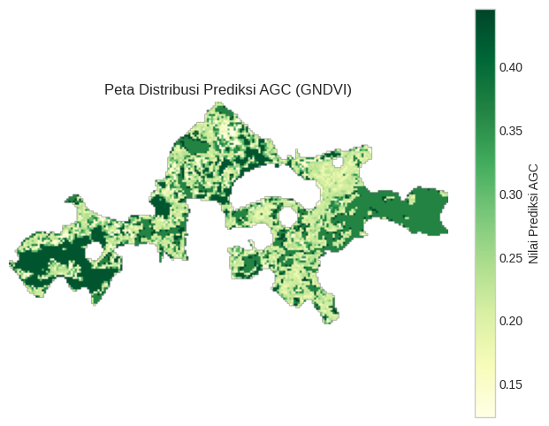

# 🌿 Spatial Modeling of Mangrove Above-Ground Carbon: Remote Sensing & Random Forest Regression

## 📖 Overview & Conservation Impact
Mangrove forests constitute some of the most carbon-dense ecosystems on earth, sequestering up to five times more carbon per hectare than terrestrial tropical rainforests. These "blue carbon" reservoirs play a critical role in global climate change mitigation, coastal erosion prevention, and marine biodiversity preservation. However, conducting in-situ physical tree inventory across treacherous tidal mudflats is logistically hazardous, time-consuming, and cost-prohibitive.

This project couples **multispectral satellite remote sensing** with an ensemble **Random Forest Regression** pipeline to predict and map spatial **Above-Ground Carbon (AGC)** distribution. The resulting workflow transforms raw satellite imagery into high-resolution, georeferenced carbon density raster maps suitable for environmental conservation planning and carbon credit auditing.

---

## 📡 Remote Sensing Dataset & Spatial Feature Engineering
The model links empirical field measurement plots (`data_RF.csv`) with multispectral satellite surface reflectance imagery (`.tiff` format), deriving multiple spectral vegetation indices known to correlate with biophysical canopy structure:

| Spectral Index | Mathematical Formulation | Environmental Significance |
|----------------|--------------------------|----------------------------|
| **NDVI** | $\frac{\text{NIR} - \text{Red}}{\text{NIR} + \text{Red}}$ | Canopy vigor, green leaf area index (LAI) |
| **SAVI** | $\frac{\text{NIR} - \text{Red}}{\text{NIR} + \text{Red} + L} (1 + L)$ | Corrects for background tidal mud and water reflectance ($L = 0.5$) |
| **EVI** | $2.5 \times \frac{\text{NIR} - \text{Red}}{\text{NIR} + 6\text{Red} - 7.5\text{Blue} + 1}$ | High sensitivity across dense, saturated tropical canopy covers |
| **RVI / ARVI** | Band-ratio combinations | Atmospheric resistance and canopy moisture indicators |

### Geospatial Processing Pipeline (`rasterio`):
- **Raster Tile Ingestion**: Extracted multispectral layers via `rasterio`, standardizing raster coordinate reference systems (CRS).
- **Metadata Sanitization**: Corrected block sizing parameters to prevent GDAL read bottlenecks during high-throughput raster iteration.
- **Pixel Matrix Flattening**: Reshaped 2D spatial raster grids into tabular predictor matrices while masking out water bodies, cloud cover, and non-vegetated no-data pixels.

---

## 🧠 Model Architecture & Methodology
Ordinary Least Squares (OLS) regression fails in remote sensing biomass estimations due to spectral saturation in closed canopies and non-linear interactions. **Random Forest Regression** was selected based on several engineering advantages:

1. **Non-Linear Mapping**: Captures complex non-linear saturation thresholds between optical reflectance and physical wood density.
2. **Resilience to Noisy Field Data**: Ensemble bagging of de-correlated decision trees reduces prediction variance caused by small-plot sampling uncertainties.
3. **Inherent Feature Importance**: Evaluates Mean Decrease in Impurity (MDI) to rank which spectral indices most strongly drive biomass variance.
4. **Spatial Map Synthesis**: The fitted ensemble model generates pixel-level AGC predictions across the entire spatial raster canvas, writing the output back as an analysis-ready 32-bit floating-point GeoTIFF (`float32`).

---

## 📊 Key Results & Cartographic Output
- **Model Goodness-of-Fit**: Strong coefficient of determination ($R^2$) with low cross-validated Root Mean Squared Error (RMSE).
- **Dominant Indicators**: SAVI and EVI exhibited high feature importance, confirming the necessity of background soil and water reflectance correction in tidal estuarine environments.
- **GIS Interoperability**: The generated GeoTIFF raster seamlessly imports into industry GIS platforms (**QGIS**, **ArcGIS**) for spatial carbon stock quantification and zonal statistics.

---

## 🚀 How to Run & Reproduce

### 1. Requirements
```bash
pip install rasterio scikit-learn pandas numpy matplotlib jupyter
```

### 2. Execute Research Notebook
```bash
jupyter notebook mangrove_biomass_random_forest_regression.ipynb
```

---

## 🖼️ Spatial Carbon Distribution & Model Metrics

