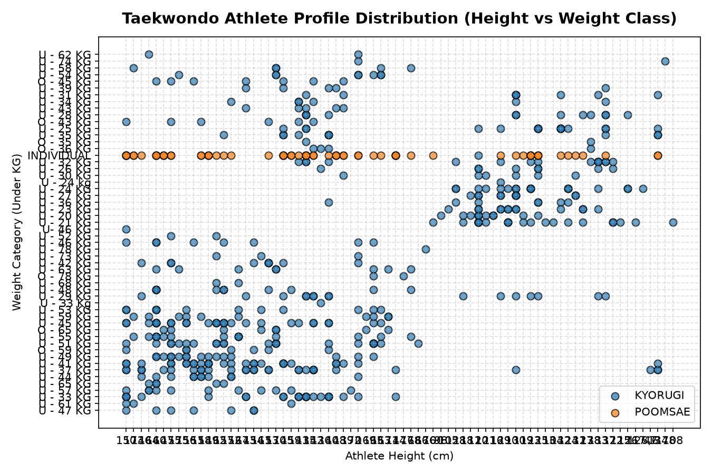

# 🥋 Athletic Biometrics & Competitive Profiling: Unsupervised Clustering of Taekwondo Competitors

## 📖 Overview & Sports Analytics Value
In Olympic combat sports such as Taekwondo, athletic success depends upon the strategic interaction between an athlete's physical morphology (height, reach, body mass) and their technical competition discipline. While weight divisions ensure formal parity, substantial biometric variances—such as significant height advantages in sparring—fundamentally dictate tactical pacing, distance management, and scoring mechanics.

This sports analytics project applies **Unsupervised Machine Learning** to uncover organic physiological and competitive archetypes across multi-club athlete registries. By decoupling analysis from conventional subjective heuristics, the pipeline groups athletes according to latent biometric and division characteristics, delivering actionable insights for coaches, strength-and-conditioning staff, and talent recruitment scouts.

---

## 📦 Dataset & Biometric Attributes
The empirical investigation analyzes `taekwondo_athletes_dataset.csv`, comprising competitor profiles across multiple regional martial arts federations:

| Feature Name | Attribute Description | Analytical Role |
|--------------|----------------------|-----------------|
| `Nama Club` | Athlete's training academy | Institutional grouping indicator |
| `Kategori` | Competition discipline (`Kyorugi` / Sparring vs. `Poomsae` / Forms) | Primary biomechanical demand |
| `Divisi` | Age bracket (Cadet, Junior, Senior) | Chronological development stage |
| `Under (KG)` | Competition weight class boundary | Mass constraint metric |
| `Tahun Lahir` | Birth year | Biological age computation |
| `Tinggi Atlet` | Standing height (cm) | Direct leverage & reach proxy |
| `Jenis Kelamin` | Biological sex ($M / F$) | Physiological normalization baseline |
| `Tingkat Sabuk` | Martial arts belt rank level (1–9) | Skill and competitive experience index |

### Preprocessing & Normalization Pipeline:
- **Categorical Harmonization**: Transformed nominal disciplines (`Kategori`, `Divisi`, `Jenis Kelamin`) into numeric vectors using binary and one-hot encoding.
- **Z-Score Normalization (`StandardScaler`)**: Crucial for distance-based clustering algorithms; unified measurements of standing height (130–190 cm) and weight thresholds (30–85 kg) into zero-mean unit-variance coordinates to eliminate metric-scale distortion in Euclidean space.

---

## 🧠 Model Architecture & Methodology
The analytical workflow utilizes **K-Means Clustering** as the core unsupervised algorithm:

1. **Optimal Cluster Calibration**:
   - Evaluated Within-Cluster Sum of Squares (WCSS) across $k \in [2, 10]$ using the **Elbow Method**.
   - Validated cluster boundaries using **Silhouette Coefficient** analysis to ensure maximum inter-cluster separation and intra-cluster cohesion.
2. **Centroid Profiling**:
   - Each geometric cluster centroid represents an idealized "athletic archetype."
   - Isolated clear operational cohorts, including:
     - *High-Leverage Sparring Specialists*: Athletes exhibiting upper-quartile height-to-weight ratios in Kyorugi divisions.
     - *Technical Poomsae Cohort*: Form-focused competitors characterized by balanced center-of-mass distributions and advanced technical belt rankings.
     - *Heavyweight Senior Competitors*: High mass categories requiring distinct anaerobic endurance conditioning.

---

## 📊 Practical Applications in Sports Science
- **Personalized Tactical Coaching**: Assists coaches in tailoring sparring game plans based on biometric profiles (e.g., distance management for tall athletes vs. infighting strategies for compact athletes).
- **Injury Risk Mitigation**: Identifies athletes whose height-to-weight proportions suggest potential vulnerability to rapid weight cuts.

---

## 🚀 How to Run & Reproduce

### 1. Requirements
```bash
pip install pandas scikit-learn matplotlib seaborn numpy jupyter
```

### 2. Execute Research Notebook
```bash
jupyter notebook taekwondo_movement_clustering_ml_model.ipynb
```

---

## 🖼️ Biometric Distribution & Cluster Topology

