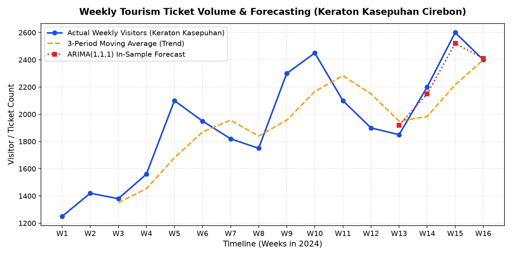

# 🏯 Cultural Tourism Visitor Forecasting: ARIMA & Time Series Analytics (Streamlit App)

## 📖 Overview & Business Value
Historic cultural heritage sites and public museums frequently operate under volatile demand cycles driven by school holidays, religious celebrations, and regional tourism seasons. At historical monuments such as **Keraton Kasepuhan Cirebon** (a 15th-century royal palace complex in West Java, Indonesia), unpredictable visitor surges cause severe operational friction: facility understaffing during peak dates leads to security bottlenecks and compromised heritage preservation, while overstaffing during lulls inflates operational expenditures.

This project delivers a production-ready **Decision Support System (DSS)** packaged as a modern **Streamlit** web application. By ingesting historical ticket sales data, the system benchmarks statistical and econometric time-series models—including **ARIMA(1,1,1)**, **Rolling Moving Averages**, and **Naive Baselines**—to forecast upcoming weekly visitor volumes and generate automated operational staffing recommendations.

---

## 📊 End-to-End 8-Stage Analytical Architecture
The Streamlit application implements an automated, structured data pipeline:

| Analytical Stage | Module Function | Technical Implementation |
|------------------|-----------------|--------------------------|
| **1. Data Ingestion** | Ingests weekly admissions records | Dynamic multi-sheet Excel ingestion (`ticket_revenue_data.xlsx`) |
| **2. Data Cleaning** | Temporal sanitization | Datetime parsing, chronological sorting, null-value imputation |
| **3. Exploratory Analysis** | Visualizes historical dynamics | Interactive time-series line charts and rolling trend overlays |
| **4. Naive Baseline** | Benchmark reference model | Persistence forecast: $\hat{Y}_{t} = Y_{t-1}$ |
| **5. Moving Average** | Trend smoothing | Rolling 3-period simple moving average ($k=3$) |
| **6. ARIMA(1,1,1)** | Parametric econometric forecasting | First-order autoregressive and moving average terms on differenced series |
| **7. Error Evaluation** | Quantitative accuracy audit | Calculates **Mean Absolute Error (MAE)** and **MAPE (%)** |
| **8. Decision Engine** | Managerial recommendations | Translates statistical projections into operational guidelines |

---

## 🧠 Econometric Modeling Rationale: Why ARIMA?
Weekly admissions exhibit non-stationary trend fluctuations and autoregressive serial correlation. **ARIMA(1,1,1)** was selected based on time-series properties:
- **Autoregressive Component ($p=1$)**: Captures positive momentum where high attendance in the preceding week elevates current baseline expectations.
- **Integrated Differencing ($d=1$)**: Eliminates stochastic trends, transforming non-stationary visitation series into stationary differentials.
- **Moving Average Component ($q=1$)**: Dampens residual shocks from unexpected weather interruptions or holiday schedule anomalies.

Comparative benchmarking against the *Naive Method* and *Moving Average* quantitatively demonstrates the statistical value-add of parametric time-series forecasting.

---

## 🚀 How to Run the Streamlit Application

### 1. Requirements
```bash
pip install streamlit pandas numpy statsmodels openpyxl matplotlib
```

### 2. Launch Local Web Application
```bash
streamlit run app.py
```

### 3. Application Workflow
Upload `ticket_revenue_data.xlsx` (or any spreadsheet with `Tanggal` and `Jumlah` columns). The application executes the 8-stage pipeline, displaying forecasting graphs, error metrics, and operational guidelines.

---

## 🖼️ Application Interface & Forecast Visualizations

