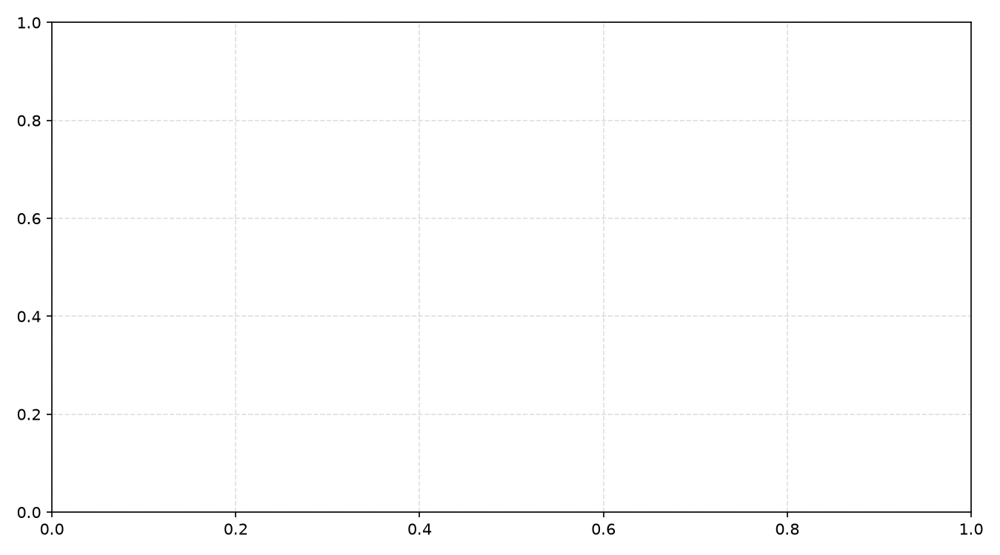

# 🗺️ Semantic Tourism Recommendation Engine: NLP Content Filtering & Geospatial Radius Optimization

## 📖 Overview & Technical Innovation
Conventional tourism search portals rely heavily on exact keyword matching and categorical taxonomy filters (e.g., searching for "park" returns only attractions with "park" in their metadata). When a traveler inputs an intent-rich semantic query—such as *"a tranquil, breezy retreat with lush shade trees and spacious parking"*—keyword-based engines fail because those exact terms are absent from the attraction's official title.

This project develops a **hybrid semantic recommendation system** that couples **Natural Language Processing (TF-IDF & Cosine Similarity)** with **Haversine Geospatial Distance Optimization**. By analyzing aggregated unstructured visitor reviews alongside geographical coordinates, the engine surfaces destinations that match a user's semantic atmosphere preferences while filtering out destinations that are geographically impractical to visit.

---

## 📦 Dataset & Dual-Pipeline Architecture
The dataset (`tourism_destinations_data.csv`) comprises thousands of Indonesian destination records compiled via an automated web scraping pipeline (`scraper.py`), containing destination names, GPS coordinates (latitude/longitude), aggregate review ratings, and visitor review text corpora.

### Dual-Stage Recommendation Architecture:
```
User Input: Natural Language Query + [User GPS Coordinates] + [Max Radius (km)]
                                      │
           ┌──────────────────────────┴──────────────────────────┐
           ▼                                                     ▼
┌──────────────────────────────────────┐     ┌──────────────────────────────────────┐
│       NLP Semantic Pipeline          │     │     Geospatial Filtering Engine      │
│ 1. Text Normalization & Stopwords    │     │ 1. Calculate Great-Circle Distance   │
│ 2. TF-IDF Matrix Transformation      │     │    via Haversine Equation            │
│ 3. Compute Query Cosine Similarity   │     │ 2. Hard Pruning: Distance ≤ Radius   │
└──────────────────┬───────────────────┘     └──────────────────┬───────────────────┘
                   │                                            │
                   └─────────────────────┬──────────────────────┘
                                         ▼
                     Merged Candidate Pool & Score Sorting
                                         ▼
                     Top-N Semantically Ranked Local Venues
```

---

## 🧠 Algorithmic Formulation

### 1. NLP Semantic Engine (TF-IDF + Cosine Metric)
Visitor reviews across each destination are merged into a unified descriptive document. The corpus is vectorized into a Term Frequency-Inverse Document Frequency (TF-IDF) feature matrix. Given an incoming user query vector $\vec{q}$ and a destination document vector $\vec{d}$, semantic affinity is evaluated as:

$$\text{Cosine Similarity}(\vec{q}, \vec{d}) = \frac{\vec{q} \cdot \vec{d}}{\|\vec{q}\|_2 \|\vec{d}\|_2}$$

### 2. Haversine Great-Circle Distance Engine
Geographic proximity accounts for the earth's spherical curvature without requiring external routing API overhead:

$$d = 2r \arcsin \left( \sqrt{\sin^2\left(\frac{\Delta \phi}{2}\right) + \cos(\phi_1)\cos(\phi_2)\sin^2\left(\frac{\Delta \lambda}{2}\right)} \right)$$

Where $\phi_1, \phi_2$ represent latitudes, $\Delta \lambda$ represents longitude difference, and $r = 6,371 \text{ km}$.

---

## 💻 Query Execution & Inference Pipeline

```python
import pandas as pd
from tourism_recommender import get_recommendations

# Natural language semantic query
user_query = "a tranquil, breezy retreat with lush shade trees and spacious parking"
user_location = (-7.250445, 112.768845)  # Surabaya coordinates

# Retrieve top 5 semantic matches within a 25 km driving radius
recommendations = get_recommendations(
    query=user_query,
    user_lat=user_location[0],
    user_lon=user_location[1],
    max_distance_km=25.0,
    top_n=5
)

print(recommendations[['name', 'distance_km', 'similarity_score', 'rating']])
```

---

## 🚀 How to Run & Reproduce

### 1. Requirements
```bash
pip install pandas scikit-learn numpy jupyter matplotlib
```

### 2. Run Notebook
```bash
jupyter notebook tourism_recommendation_analysis.ipynb
```

---

## 🖼️ Geospatial Distribution & Rating Metrics

