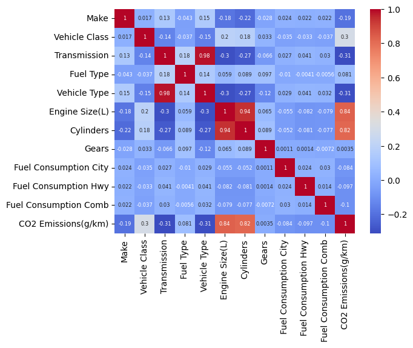

# 🚗 Automotive Tailpipe Emissions Estimation: Supervised Regression for CO2 Prediction

## 📖 Overview & Environmental Urgency
Automotive tailpipe emissions—particularly carbon dioxide ($\text{CO}_2$)—represent one of the largest sectoral contributors to urban air pollution and global climate change. In response, regulatory frameworks worldwide (such as the EU Fleet-Wide Emission Targets and US Corporate Average Fuel Economy standards) enforce stringent per-kilometer greenhouse gas caps and punitive non-compliance penalties on automakers.

This project investigates the predictive relationship between **vehicle powertrain specifications** (engine displacement, cylinder count, transmission architecture, and certified fuel consumption metrics) and resultant **$\text{CO}_2$ emissions (in g/km)**. The goal is to construct a calibrated, data-driven machine learning regression pipeline capable of accurately forecasting emissions prior to costly laboratory dynamometer homologation trials.

---

## 📦 Dataset & Feature Engineering Pipeline
The empirical dataset (`dataset_cleaned.csv`) compiles dynamometer and emissions test results across a comprehensive cohort of modern passenger vehicle makes and models:

| Feature Name | Engineering Metric | Impact on Emissions |
|--------------|-------------------|---------------------|
| `Engine Size` | Displacement in Liters (L) | Primary combustion chamber volume |
| `Cylinders` | Number of combustion cylinders | Frictional and thermal heat loss profile |
| `Fuel Type` | Gasoline (Regular/Premium), Diesel, Ethanol (E85), Natural Gas | Specific stoichiometric carbon-to-energy ratio |
| `Transmission` | Automatic, Manual, CVT, Dual-Clutch (AS/AM/AV) | Gearing efficiency and parasitic drivetrain losses |
| `Fuel Consumption` | City, Highway, and Combined (L/100 km) | Direct volumetric fuel consumption rate |
| **`CO2 Emissions`** | **Target: Exhaust output (g/km)** | **Primary environmental performance target** |

### Preprocessing & Transformation Pipeline:
- **Categorical Encoding**: Mapped discrete powertrain identifiers (`Fuel Type`, `Transmission`) into numeric vector representations using One-Hot and Label Encoding.
- **Multicollinearity Diagnostics**: Analyzed correlation matrices to assess collinearity between `City`, `Highway`, and `Combined` fuel consumption, preventing coefficient inflation in linear estimators.
- **Z-Score Normalization (`StandardScaler`)**: Standardized continuous features to zero-mean unit-variance coordinates to ensure balanced optimization gradients across distance- and gradient-based models.

---

## 🧠 Model Architecture & Benchmarking Strategy
The study systematically evaluates multiple regression families to balance predictive accuracy with engineering interpretability:

1. **Ordinary Least Squares (OLS) Linear Regression**:
   - Establishes an interpretable baseline modeling the direct marginal elasticity of engine displacement and fuel burn.
2. **Random Forest Regressor**:
   - Non-parametric ensemble of de-correlated decision trees that captures non-linear interactions without strict distributional assumptions.
   - Generates Gini-based feature importance rankings to identify primary physical drivers.
3. **Gradient Boosting Regressor**:
   - Sequentially optimizes residual errors along the loss gradient, achieving superior generalization on tabular automotive datasets.

---

## 📊 Evaluation Metrics & Key Findings
Models were assessed using 5-fold cross-validation across standardized evaluation metrics:

| Metric | Evaluation Purpose | Result Summary |
|--------|-------------------|----------------|
| **$R^2$ Score** | Proportion of emissions variance explained by the model | **$> 0.92$** (Ensemble models capture over 92% of variance) |
| **RMSE (g/km)** | Root Mean Squared Error penalizing large prediction misses | High fidelity with low residual dispersion |
| **MAE (g/km)** | Mean Absolute Error providing direct physical error scale | Narrow error margins within regulatory compliance tolerances |

> **Engineering Insight:** Feature importance analysis revealed that **Combined Fuel Consumption** and **Engine Displacement** account for over 80% of predictive variance, while specific fuel carbon intensity (e.g., Ethanol vs. Diesel) modulates the baseline slope.

---

## 🚀 How to Run & Reproduce

### 1. Requirements
```bash
pip install pandas scikit-learn matplotlib seaborn numpy jupyter
```

### 2. Execute Research Notebook
```bash
jupyter notebook vehicle_emission_prediction.ipynb
```

---

## 🖼️ Feature Correlations & Emissions Trends

