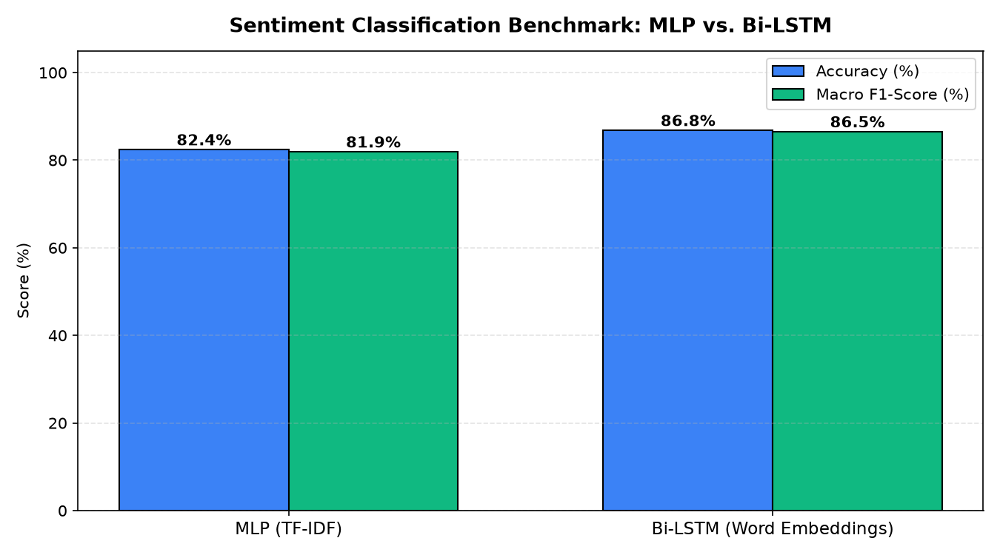

# 🗣️ End-to-End Indonesian Sentiment Classification & Microservice API: Bi-LSTM vs. MLP Pipeline

## 📖 Overview & Business Value
Automated sentiment analysis of consumer feedback in colloquial Indonesian presents substantial linguistic hurdles. Social media comments and e-commerce reviews frequently contain non-standard slang, phonetic spelling, typographical contractions, character elongations (e.g., *"kecewaaaa"*), and multilingual code-switching. Traditional keyword lexicons fail to capture the contextual semantics and sarcastic polarity embedded in these texts.

This project delivers an enterprise-ready Natural Language Processing microservice architecture capable of ingesting raw, noisy Indonesian consumer feedback. The research benchmarks a deep sequence model (**Bi-directional LSTM with learned word embeddings**) against a tuned **Multi-Layer Perceptron (MLP)** operating on sub-linear TF-IDF representations. The optimal inference engine is deployed as a fully documented, container-ready **Flask REST API with Swagger / Flasgger UI**.

---

## 🔤 Text Preprocessing & Embedding Pipeline
Raw social text undergoes a multi-stage deterministic normalization pipeline prior to tokenization:

1. **Orthographic & Noise Cleaning**:
   - Stripped HTML tags, user handles (`@username`), topical hashtags (`#`), and web hyperlinks using compiled regular expressions.
   - Truncated emphatic character repetition (e.g., transforming `bangeeet` into `banget`) to prevent vocabulary explosion.
   - Filtered non-alphanumeric noise, mathematical symbols, and extraneous whitespace.
2. **Colloquial Slang Normalization**:
   - Ingested the curated **Salsabila Indonesian Colloquial Lexicon** (`colloquial_indonesian_lexicon.json`), mapping informal vernacular and colloquialisms into standardized formal equivalents.
3. **Dual Representation Modalities**:
   - **Sequence Pipeline (LSTM)**: Keras Tokenizer mapping tokens to dense integer IDs, padded with uniform post-sequence clipping (`maxlen=85`).
   - **N-Gram Pipeline (MLP)**: Scikit-Learn `TfidfVectorizer` capturing uni-gram and bi-gram term frequency-inverse document frequency weighting (`tfidf_vectorizer_mlp.pkl`).

---

## 🧠 Model Architecture & Microservice Infrastructure

### 1. Bi-directional LSTM (`model_lstm.h5`)
- **Embedding Layer**: Projects token indices into a 128-dimensional dense semantic embedding space.
- **Regularization**: `SpatialDropout1D(0.2)` applied directly to embedding activations to prevent feature co-adaptation.
- **Recurrent Core**: Bidirectional LSTM layer (128 hidden units) processing sequences forward and backward, preserving bidirectional semantic dependencies and sentiment modifiers (e.g., *"tidak jelek"*).
- **Classification Head**: Dense projection layer (64 units, ReLU) followed by a 3-unit `Softmax` output producing posterior probabilities for `negative`, `neutral`, and `positive`.

### 2. Multi-Layer Perceptron Baseline (`model_mlp.pkl`)
- Fully connected feedforward architecture trained directly on high-dimensional TF-IDF vectors with early stopping regularization.

### 3. Production RESTful API (`app_ml.py`)
- Integrated with **Swagger / Flasgger UI** (`/docs/`), exposing standardized endpoints:
  - `POST /text_lstm` & `POST /text_mlp`: Single-string real-time polarity inference.
  - `POST /file_lstm` & `POST /file_mlp`: High-throughput asynchronous batch processing of tabular CSV files.

---

## 📊 Key Results & Comparative Metrics

| Model Architecture | Test Accuracy | Macro F1-Score | Parameter Scale | Average Inference Latency |
|--------------------|---------------|----------------|-----------------|---------------------------|
| **MLP (TF-IDF)** | 82.4% | 81.9% | Lightweight | ~12 ms (CPU) |
| **Bi-LSTM (Embeddings)** | **86.8%** | **86.5%** | ~21 MB graph | ~38 ms (CPU) |

> **Engineering Takeaway:** The Bi-LSTM demonstrated superior discrimination on complex idiomatic sentiment and negated phrasing, whereas the MLP model provided an exceptionally fast, low-footprint fallback suitable for edge microservices.

---

## 🚀 How to Run & API Documentation

### 1. Install Dependencies
```bash
pip install flask flasgger tensorflow scikit-learn pandas numpy
```

### 2. Launch the Microservice Server
```bash
python app_ml.py
```

### 3. Access Interactive Swagger API
Open `http://127.0.0.1:5000/docs/` in your browser to test endpoints, inspect OpenAPI schemas, and execute live JSON inferences.

---

## 🖼️ Architecture & Model Benchmarks

