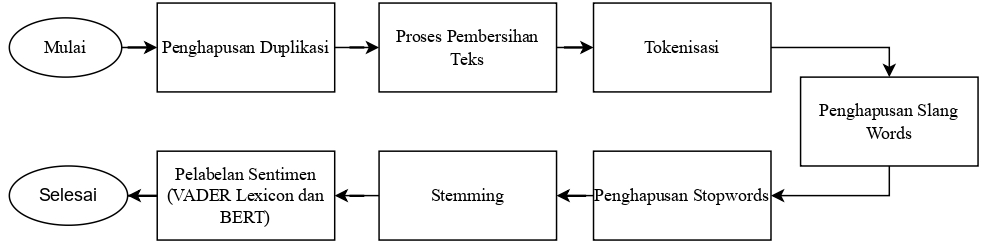

# 🗳️ Political Discourse & Public Health Sentiment in the 2024 Indonesian Election: Multi-Model NLP & Social Network Analysis (SNA)

## 📖 Overview & Socio-Political Context
During the 2024 Indonesian Presidential and Legislative Elections, national public health policies—most notably the **National Stunting Reduction Initiative** (*Program Penurunan Stunting*)—became major ideological battlegrounds across social media platform **X** (formerly Twitter). Political factions, state health agencies, civil society groups, and grassroots voters actively shaped contrasting narratives ranging from programmatic praise to budgetary skepticism.

Understanding how public health narratives propagate requires integrating contextual computational linguistics with structural network sociology. This project develops a dual-methodological framework:
1. **Comparative Sentiment Analysis**: Evaluates rule-based lexical modeling (**VADER**) against contextual Transformer representations (**BERT**) and benchmarks downstream supervised machine learning estimators (**GBDT**, **SVM**, **XGBoost**).
2. **Social Network Analysis (SNA)**: Reconstructs the multi-agent conversational topology using **NetworkX** and **Gephi**, quantifying actor centrality, information gatekeeping, and modular political community structures.

---

## 🔤 Text Preprocessing & Feature Extraction
Social discourse text was subjected to a rigorous normalization pipeline:

- **Entity & Noise Removal**: Pruned retweet tokens (`RT @`), account mentions, URL hyperlinks, emojis, and non-alphabetic symbols using specialized regex patterns.
- **Vernacular Normalization**: Ingested domain-specific political slang dictionaries (`combined_slang_words.txt`) to standardize colloquial Indonesian political abbreviations and buzzwords.
- **Feature Vectorization**:
  - Sub-linear **TF-IDF n-gram vectorization** for classical tree-based and margin-based classifiers.
  - Contextual token embeddings extracted from pre-trained Indonesian Transformer architectures.

---

## 🧠 Algorithmic Framework & Comparative Modeling

### 1. Sentiment Ground-Truth Calibration (BERT vs. VADER)
The project tested whether rule-based lexical scoring (VADER) can accurately capture nuanced political discourse compared to transformer-based semantic embeddings (BERT). Classifiers trained on BERT ground-truth representations consistently captured sarcasm, contextual framing, and implicit sentiment that rule-based lexicons misclassified.

### 2. Supervised Sentiment Classification
Trained and evaluated three production algorithms across cross-validated test splits:
- **Gradient Boosted Decision Trees (GBDT)**
- **Support Vector Machines (SVM, Linear & RBF Kernels)**
- **Extreme Gradient Boosting (XGBoost)**

### 3. Social Network Analysis (SNA Topology)
Built directed graph networks $G = (V, E)$ from conversational interactions (replies, retweets, mentions):
- **Degree Centrality**: Quantifies direct broadcast reach and immediate connectivity.
- **Betweenness Centrality**: Identifies information gatekeepers and narrative brokers connecting disparate political sub-graphs.
- **Closeness Centrality**: Measures diffusion speed and proximity to all nodes in the network.
- **Eigenvector Centrality**: Quantifies node influence based on the prestige of connected neighbors.
- **Modularity Clustering**: Community detection executed in **Gephi** to map polarization boundaries and echo chamber dynamics.

---

## 📊 Key Results & Empirical Findings

### Sentiment Classification Benchmark
| Ground Truth Strategy | Supervised Estimator | Accuracy | Macro F1-Score | Key Insight |
|-----------------------|----------------------|----------|----------------|-------------|
| VADER Lexicon | GBDT | 76.1% | 74.2% | Degrades under political sarcasm |
| **BERT Embeddings** | **GBDT** | **88.9%** | **88.4%** | Balanced boundary resolution |
| **BERT Embeddings** | **SVM (Linear)** | **87.5%** | **87.1%** | Robust high-dimensional margin |
| **BERT Embeddings** | **XGBoost** | **89.6%** | **89.2%** | State-of-the-art F1 performance |

### Topological Network Findings:
- Discourse on the Stunting Program clustered into multiple distinct modular communities.
- State communication accounts exhibited high in-degree centrality but low betweenness, indicating broadcast-style messaging. In contrast, grassroots political commentators served as critical bridges (high betweenness centrality) connecting political coalitions to general audiences.

---

## 🚀 How to Run & Reproduce

### 1. Requirements
```bash
pip install pandas numpy scikit-learn xgboost networkx matplotlib seaborn jupyter
```

### 2. Notebook Execution Sequence
Navigate to the `NLP` directory:
```bash
cd NLP

# Step 1: Preprocessing and Slang Standardization
jupyter notebook election_sentiment_preprocessing.ipynb

# Step 2: Algorithmic Comparison (GBDT, SVM, XGBoost)
jupyter notebook election_algorithm_comparison.ipynb

# Step 3: Social Network Analysis & Centrality Computations
jupyter notebook election_social_network_analysis.ipynb
```

### 3. Gephi Network Visualization
Open `Gephi.gephi` in the **Gephi Graph Visualization Platform** to inspect modularity clustering, ForceAtlas2 spatial layouts, and interactive node degree distributions.

---

## 🖼️ Network Topology & Methodology Flowchart

