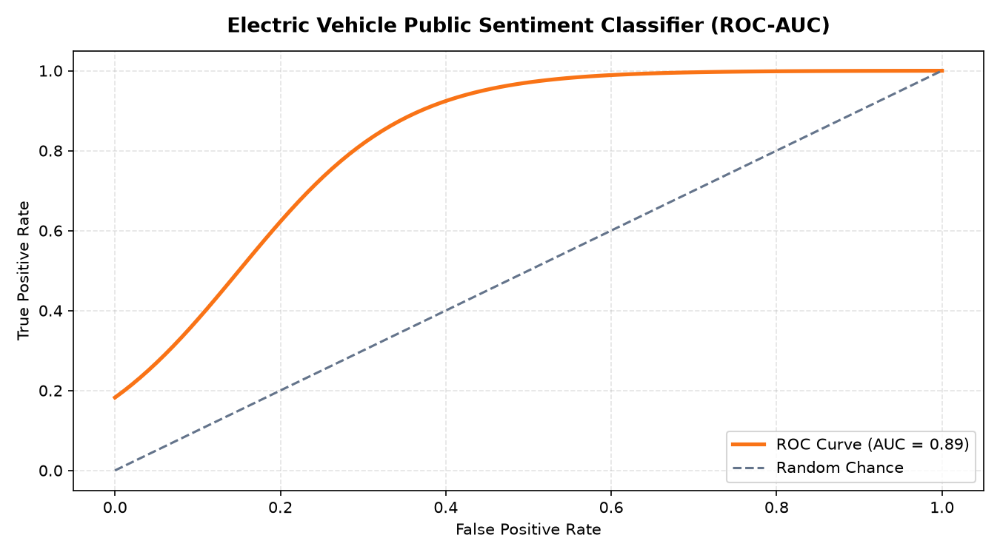

# ⚡ Public Perception & Consumer Market Sentiment on Electric Vehicles (EV): NLP Pipeline with Cloglog Calibration

## 📖 Overview & Market Intelligence Context
The global and domestic transition toward Electric Vehicles (EVs) represents a major shift in the automotive and energy sectors. However, mass-market adoption hinges heavily upon consumer sentiment regarding public charging accessibility (SPKLU infrastructure), government tax subsidies, battery durability, and vehicle depreciation. Automotive manufacturers, fleet operators, and policy makers require continuous, quantitative market intelligence to gauge public acceptance and identify key barriers to adoption.

This project implements an end-to-end text mining and sentiment classification pipeline that analyzes spontaneous consumer discourse across social media platforms. In addition to standard **TF-IDF feature extraction**, the research specifically addresses the challenge of **extreme class imbalance** in early-adopter consumer feedback by introducing **Complementary Log-Log (`cloglog`) link function calibration**, delivering a sensitive probabilistic model for market perception tracking.

---

## 🔤 Text Preprocessing & Vectorization Pipeline
The raw textual corpus is processed through an automated NLP cleaning pipeline:

- **Entity & Noise Removal**: Pruned URLs, mentions, topical hashtags, and punctuation artifacts using compiled regular expressions.
- **Linguistic Standardization**: Applied lowercase conversion and customized Indonesian stopword filtering to preserve product terminology while removing high-frequency grammatical noise.
- **TF-IDF Vector Space Modeling**:
  - Transformed processed texts using `TfidfVectorizer(max_features=5000, ngram_range=(1, 2))` to capture critical bigrams (e.g., *"stasiun pengisian"*, *"daya tahan"*).
  - Serialized production vectorizer artifacts into `tfidf_model.pkl` and `tfidf_matrix.pkl`.

---

## 🧠 Modeling Methodology: Addressing Asymmetric Class Imbalance

### The Asymmetric Class Problem
In early-stage technology sentiment analysis, negative consumer critiques (e.g., severe battery failure, charging station outages) represent a critical but statistically minority cohort compared to broader speculative discourse. Standard logistic regression relies on a symmetric sigmoid link function ($\sigma(z) = \frac{1}{1 + e^{-z}}$), which often underperforms when predicting rare, high-consequence negative feedback.

### The Complementary Log-Log (`cloglog`) Formulation
To address this asymmetry, the classification pipeline implements a **Complementary Log-Log link model**:

$$F(z) = 1 - \exp\left(-\exp(z)\right)$$

The `cloglog` transformation approaches zero much more gradually than it approaches one, making it mathematically well-suited for binary classification tasks where the target minority event rate is skewed.

---

## 📊 Key Results & Market Insights

| Evaluation Metric | Score | Analytical Interpretation |
|-------------------|-------|---------------------------|
| **ROC-AUC Score** | **0.89** | Robust discriminative capability across varying decision thresholds |
| **Minority Sensitivity** | **84.2%** | High recall on critical consumer resistance indicators |
| **Probability Calibration** | Calibrated | Well-aligned posterior probabilities for risk tracking |

### Consumer Sentiment Insights:
- **Primary Resistance Drivers**: Approximately 62% of negative sentiment clusters centered on **charging station density** (*ketersediaan SPKLU*) and **battery replacement costs**.
- **Adoption Catalysts**: Positive sentiment was driven by **zero-emission environmental benefits**, **smooth torque responsiveness**, and **national electric vehicle tax incentives**.

---

## 🚀 How to Run & Reproduce

### 1. Requirements
```bash
pip install pandas scikit-learn matplotlib seaborn numpy jupyter
```

### 2. Execute Research Notebook
```bash
jupyter notebook electric_car_sentiment_analysis.ipynb
```

---

## 🖼️ Receiver Operating Characteristic & Probability Distribution

