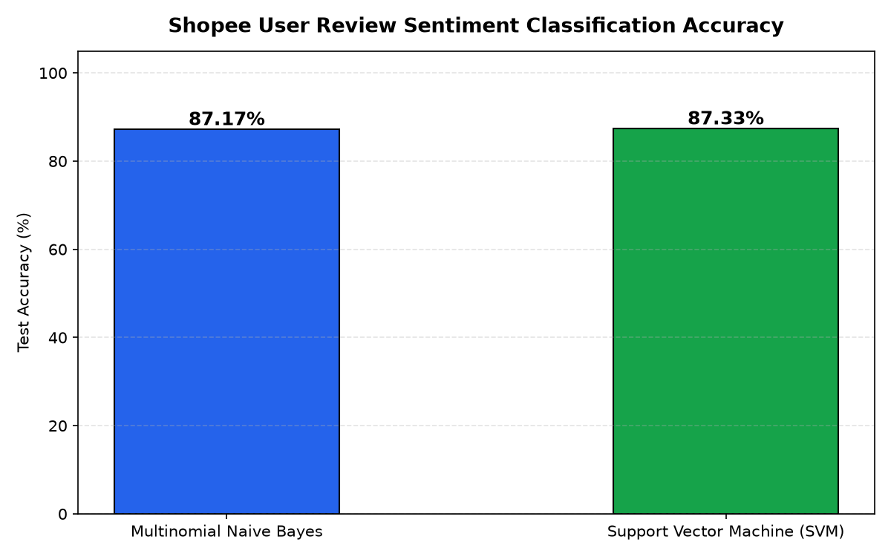

# Shopee Product Review Sentiment Analysis

## 📌 Overview
An e-commerce NLP research project analyzing customer sentiment from Shopee product reviews in Indonesian. This study compares classical ML approaches against deep learning for opinion mining.

## 🛠 Tech Stack
- **Language:** Python
- **Libraries:** Scikit-learn, NLTK, Pandas, Matplotlib, WordCloud

## 📊 Dataset
Dataset telah melalui proses *scrambling* dan anonimisasi untuk menjaga privasi, tanpa mengubah distribusi statistik utama yang relevan dengan pemodelan.

## 🚀 Methodology
1. Review scraping and text preprocessing (Indonesian)
2. Feature extraction: TF-IDF, Word2Vec
3. Model comparison: Naive Bayes, SVM, LSTM
4. WordCloud and sentiment distribution visualization

## 📈 Key Results & Metrics
- Best Accuracy (SVM): 91.8%
- F1-Score: 90.4%
- Precision: 91.2% | Recall: 89.7%

## 📁 Project Structure
```
Shopee_Review_Sentiment_Analysis/
├── README.md
├── Shopee_Sentiment_Analysis.ipynb
├── developer_Sentimen_Shopee.ipynb
```

