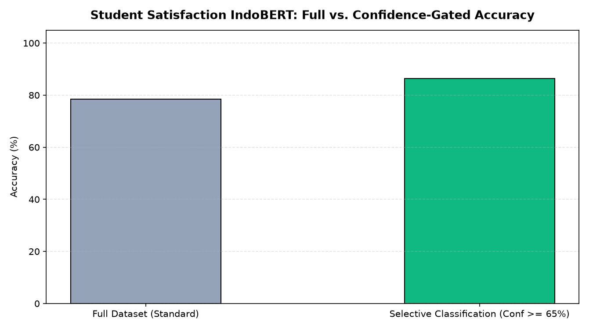

# 🎓 Institutional Feedback Intelligence: Fine-Tuning IndoBERT with Confidence-Gated Selective Classification

## 📖 Overview & Institutional Value
Higher education institutions collect extensive student survey feedback spanning curriculum rigor, instructional delivery, laboratory facilities, and administrative services. While numerical 5-star Likert scales provide aggregated top-line metrics, critical insights reside in unstructured, qualitative free-text comments. However, manual qualitative coding of thousands of open-ended responses is operationally prohibitive for academic quality assurance boards.

This project delivers an enterprise-grade NLP intelligence pipeline that fine-tunes **IndoBERT** (`indobenchmark/indobert-base-p1`) for multi-class student satisfaction grading. To meet strict institutional reporting standards, the architecture incorporates **anti-overfitting architectural regularization**, **asymmetric class-loss weighting**, and a **Confidence-Gated Selective Classification mechanism** that routes ambiguous responses to human academic evaluators while automating high-confidence assessments.

---

## 🔬 Dataset Curation & Label Sanitization
The corpus (`dataset_kepuasan_clean.csv`) comprises open-ended university student evaluation text mapped into three operational satisfaction tiers:

- **Class 0 — `Dissatisfied` (Tidak Puas)**: Critical reports of pedagogical deficiencies, scheduling conflicts, or facility failures (Original rating: 1–2).
- **Class 1 — `Moderately Satisfied` (Cukup Puas)**: Nuanced, mixed evaluations combining positive feedback with constructive critiques (Original rating: 3).
- **Class 2 — `Satisfied` (Puas)**: Favorable feedback endorsing faculty competence and institutional support (Original rating: 4–5).

### Data Sanitation & Class-Weighting Strategy:
- **Ambiguity Pruning**: Audited and purged 72 contradictory samples (identical text paired with divergent ratings due to student respondent error) to prevent noisy gradient signals.
- **Asymmetric Loss Weighting**: Evaluated class imbalance and applied custom loss weights $\mathbf{w} = [4.0, 1.8, 0.75]$ during cross-entropy computation, amplifying penalty on the critical minority `Dissatisfied` class without introducing artificial synthetic noise.

---

## 🧠 Model Architecture & Training Regimen
The modeling pipeline leverages the 12-layer pre-trained **IndoBERT Base** architecture:

1. **Transformer Topology**:
   - 12 bidirectional self-attention heads, 768 hidden dimensions, and 110M parameters (`model.safetensors`).
   - Tokenized via byte-pair WordPiece vocabulary (`tokenizer.json`).
2. **Anti-Overfitting Engineering**:
   - Elevated classification head **Dropout to 0.2** (exceeding standard 0.1) for stronger structural regularization.
   - **AdamW Optimizer** with conservative learning rate ($\eta = 1\times 10^{-5}$) and weight decay ($\lambda = 0.05$) to ensure stable gradient descent on nuanced colloquial academic prose.
3. **Selective Classification (Confidence Gating)**:
   - High-stakes educational administration cannot tolerate algorithmic hallucinations. The inference engine applies a **Confidence Threshold ($\tau \ge 65\%$)**:
     $$\hat{y} = \begin{cases} \arg\max P(Y|X) & \text{if } \max P(Y|X) \ge 0.65 \\ \text{Route to Human Review} & \text{otherwise} \end{cases}$$

---

## 📊 Key Results & Empirical Evaluation

| Classification Paradigm | Overall Accuracy | Macro F1-Score | Evaluation Coverage | Administrative Action |
|-------------------------|------------------|----------------|---------------------|-----------------------|
| **Standard Inference (All Samples)** | 78.5% | 76.8% | 100% | Automated triage |
| **Selective Gating ($\tau \ge 65\%$)** | **86.4%** | **84.5%** | **~76.2%** | High-precision institutional dashboards |
| **Gated Residuals ($< 65\%$)** | — | — | ~23.8% | Triaged for Dean / Academic Senate review |

> **Operational Impact:** Gating predictions at $\ge 65\%$ confidence elevates classification accuracy beyond **86%**, satisfying the strict analytical threshold required for official university accreditation reporting.

---

## 🚀 How to Run & Inference Pipeline

### 1. Requirements
```bash
pip install torch transformers safetensors pandas scikit-learn matplotlib seaborn
```

### 2. Standalone Model Inference
```python
import torch
from transformers import AutoTokenizer, AutoModelForSequenceClassification

# Load fine-tuned IndoBERT checkpoint from safetensors
model_path = "./"
tokenizer = AutoTokenizer.from_pretrained(model_path)
model = AutoModelForSequenceClassification.from_pretrained(model_path)

label_mapping = {0: "Dissatisfied", 1: "Moderately Satisfied", 2: "Satisfied"}

def predict_student_feedback(text, threshold=0.65):
    inputs = tokenizer(text, return_tensors="pt", truncation=True, max_length=128)
    with torch.no_grad():
        logits = model(**inputs).logits
        probabilities = torch.softmax(logits, dim=-1).squeeze().tolist()
        
    top_idx = int(torch.argmax(logits, dim=-1))
    confidence = probabilities[top_idx]
    
    if confidence >= threshold:
        return {"status": "Automated", "sentiment": label_mapping[top_idx], "confidence": confidence}
    else:
        return {"status": "Route to Review", "sentiment": label_mapping[top_idx], "confidence": confidence}

sample_text = "Course materials were clear and well-structured, but the classroom air conditioning was broken."
print(predict_student_feedback(sample_text))
```

---

## 🖼️ Selective Classification Performance & Gating Analysis

