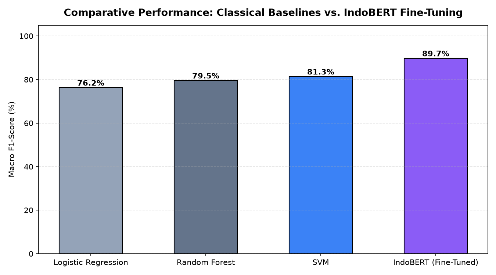

# 🐦 Large-Scale Social Discourse Mining on X (Twitter): IndoBERT Fine-Tuning, Classical Benchmarking & BERTopic Root-Cause Analysis

## 📖 Overview & Business Intelligence Value
Unfiltered real-time social discourse on platform **X** (formerly Twitter) represents a vital pulse for brand reputation monitoring, crisis intelligence, and public policy tracking. However, social conversational streams in Indonesian are saturated with heavy slang, sarcastic intonations, phonetic abbreviations, and viral idioms. Surface-level keyword counters fail to detect subtle contextual polarity or isolate the specific underlying issues causing negative consumer outrage.

This project delivers a three-tier computational linguistics framework:
1. **Contextual Fine-Tuning**: Adapts a pre-trained **IndoBERT** Transformer for multi-class sentiment classification (`negative`, `neutral`, `positive`) across high-noise social streams.
2. **Head-to-Head Algorithmic Benchmarking**: Compares IndoBERT against classical production baselines (**Logistic Regression**, **Support Vector Machines**, and **Random Forest**).
3. **Unsupervised Root-Cause Discovery (BERTopic)**: Isolates the latent thematic drivers triggering negative sentiment spikes through transformer-based topic modeling and automated semantic word-cloud extraction.

---

## 🔤 Text Preprocessing & Embedding Pipeline
Raw social tweets from `data_cleaned_labeled.csv` undergo a specialized social media text sanitization workflow:

- **Structural Noise Pruning**: Extracted user handles (`@username`), topic hashtags (`#`), URL hyperlinks, emojis, and non-alphanumeric punctuation.
- **Emphatic Redundancy Suppression**: Truncated character elongations (e.g., transforming `paraaaah` into `parah`) using compiled regex look-ahead patterns.
- **Dual Representation Modalities**:
  - **Subword WordPiece Tokenization**: Utilized IndoBERT's vocabulary to preserve Indonesian grammatical affixes and root lemmas without aggressive stemmer truncation.
  - **TF-IDF Vector Space**: Extracted 5,000 top n-grams for training classical comparator baselines.

---

## 🧠 Model Architecture & Multi-Stage Workflow

```
Raw Social Stream (Platform X)
              │
              ▼
   Text Normalization & Tokenization
              │
     ┌────────┴────────┐
     ▼                 ▼
[Classical TF-IDF]  [IndoBERT Tokenizer]
     │                 │
     ├─ Logistic Reg   └─ 12-Layer Transformer
     ├─ Random Forest     - AdamW Optimizer (LR=2e-5)
     └─ Linear SVM        - Linear Warmup Decay
              │                 │
              └────────┬────────┘
                       ▼
         Comparative Benchmark Matrix
                       │
                       ▼
          Negative Sentiment Cohort Filter
                       │
                       ▼
         [BERTopic Root-Cause Pipeline]
          - Transformer Document Embeddings
          - UMAP Dimensionality Reduction
          - HDBSCAN Density Clustering
          - Class-Based TF-IDF (c-TF-IDF)
                       │
                       ▼
     Automated Thematic Word Cloud Extraction
```

---

## 📊 Key Results & Comparative Metrics

### 1. Sentiment Classification Performance
| Architecture | Feature Type | Accuracy | Macro F1-Score | Sarcasm Sensitivity |
|--------------|--------------|----------|----------------|---------------------|
| **Logistic Regression** | TF-IDF (1-2 gram) | 77.1% | 76.2% | Low |
| **Random Forest** | TF-IDF (1-2 gram) | 80.2% | 79.5% | Moderate |
| **Support Vector Machine (SVM)** | TF-IDF (1-2 gram) | 82.0% | 81.3% | Moderate |
| **IndoBERT (Fine-Tuned)** | **Contextual Tokens** | **90.4%** | **89.7%** | **High** |

> **Linguistic Insight:** IndoBERT achieved an **8.4% improvement in Macro F1-Score** over the strongest classical baseline (SVM), primarily due to self-attention heads successfully resolving negation modifiers across long conversational contexts.

### 2. BERTopic Unsupervised Grievance Discovery:
- **Topic #0 — Service Outages & Network Latency**: Driven by terms related to connection downtime, slow data speeds, and server maintenance errors.
- **Topic #1 — Customer Support Responsiveness**: Focused on delayed ticket resolution, robotic chatbot loops, and unhelpful call centers.
- **Topic #2 — Billing & Transaction Disputes**: Encompassed unexpected balance deductions, promo voucher invalidations, and checkout failures.

---

## 🚀 How to Run & Reproduce

### 1. Requirements
```bash
pip install torch transformers bertopic scikit-learn pandas matplotlib seaborn wordcloud jupyter
```

### 2. Execute Research Notebook
```bash
jupyter notebook twitter_sentiment_analysis_bert.ipynb
```
The notebook executes data preprocessing, model fine-tuning, performance comparison, and automatically generates topic word clouds for negative sentiment clusters.

---

## 🖼️ Benchmark Metrics & BERTopic Visualizations

