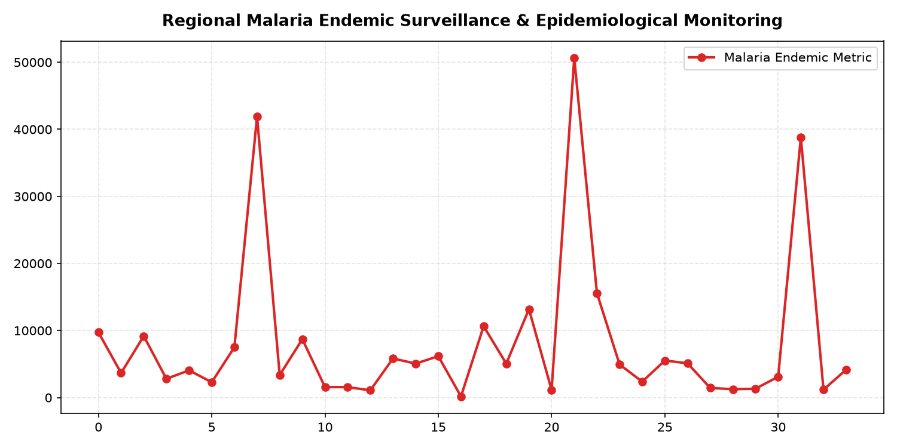

# 🦟 Epidemiological Surveillance & Spatial Disease Mapping: R Shiny Dashboard for Regional Malaria Monitoring

## 📖 Overview & Epidemiological Impact
Malaria remains a critical vector-borne public health challenge in tropical and sub-tropical regions. Effective disease containment and eradication require robust spatial epidemiological surveillance tools capable of tracking localized case incidence, detecting infection clusters, evaluating non-linear climatic determinants (rainfall, humidity, temperature), and accounting for statistical overdispersion in count data.

This project delivers a comprehensive, production-grade **R Shiny Interactive Surveillance Dashboard** (`app.R`). The system integrates interactive spatial GIS mapping (**Leaflet**), spatial disease cluster detection (**DCluster**), and advanced count regression modeling (**GAMLSS** and **VGAM**), equipping regional health departments and epidemiologists with an operational decision support system to track malaria outbreaks and target vector-control interventions.

---

## 🛠️ Architecture & Technology Stack
- **Web Application Framework**: R Shiny, `shinydashboard` (`app.R`).
- **Geospatial & Clustering Engines**: `leaflet`, `DCluster` (Spatial Disease Clustering).
- **Statistical Modeling & Econometrics**:
  - `gamlss` (Generalized Additive Models for Location, Scale, and Shape).
  - `VGAM` (Vector Generalized Linear and Additive Models).
  - `AER` & `lmtest` (Overdispersion and diagnostic hypothesis testing).
- **Data Analytics & Visualization**: `ggplot2`, `DT` (interactive DataTables), `pheatmap` (hierarchical clustering heatmaps).
- **Data Layer**: Standardized regional epidemiological records (`malaria_dataset.xlsx`, `datates.xlsx`).

---

## 🔄 Methodology & Surveillance Architecture

```
Epidemiological Case Registries (malaria_dataset.xlsx)
                         │
                         ▼
       Shiny Reactive Server Logic (app.R)
  ┌──────────────────────┼──────────────────────┐
  ▼                      ▼                      ▼
Spatial GIS Layer   Count Regression       Visual Analytics
├── Leaflet Maps    ├── Overdispersion     ├── Time-Series Curves
├── Spatial Risk        Diagnostics        ├── Correlation Heatmap
│   Contours        ├── Negative Binomial  │   (pheatmap)
└── DCluster            & Zero-Inflated    └── Dynamic DataTables
    Hotspots            Formulations           (DT Engine)
  │                      │                      │
  └──────────────────────┼──────────────────────┘
                         ▼
        Interactive Shiny Dashboard Interface
```

---

## 📊 Key Dashboard Features & Epidemiological Modeling

### 1. Interactive Geospatial Risk Mapping (`leaflet`)
- Visualizes localized **Annual Parasite Incidence (API)** across regional administrative health districts.
- Renders dynamic choropleth polygon overlays and point-source markers colored by disease endemicity tiers (Low, Moderate, High Transmission).

### 2. Advanced Count Regression Diagnostics
- Standard Poisson models frequently fail on epidemiological count data due to **overdispersion** ($\text{Var}(Y) > \text{E}(Y)$) and excess zeros.
- The pipeline utilizes `AER` dispersion tests to benchmark **Negative Binomial** and **Zero-Inflated Poisson (ZIP)** models, producing reliable confidence intervals for climatic risk factors.
- Integrates `gamlss` to capture flexible, non-linear splines linking environmental indices (precipitation anomalies, thermal variations) to localized mosquito vector breeding cycles.

### 3. Hierarchical Phenotype Clustering (`pheatmap`)
- Uncovers cross-district transmission correlations, grouping regions with synchronized outbreak timelines.

---

## 🚀 How to Run Locally

### 1. Install Required R Packages
Launch R or RStudio and install dependencies:
```r
install.packages(c(
  "shiny", "shinydashboard", "leaflet", "readxl", "DT", 
  "ggplot2", "pheatmap", "RColorBrewer", "DCluster", 
  "VGAM", "gamlss", "lmtest", "nortest", "AER", 
  "dplyr", "openxlsx"
))
```

### 2. Launch Shiny Application
Run the following command from the project root directory:
```r
shiny::runApp()
```
The interactive dashboard will open automatically in your default browser or RStudio Viewer pane.

---

## 🖼️ Surveillance Dashboard & Epidemic Curves

