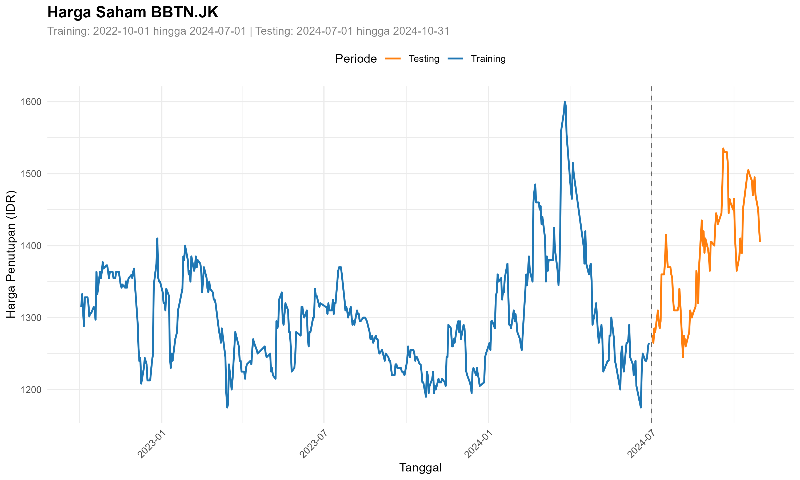

# 📈 Quantitative Asset Allocation: Markowitz Efficient Frontier & Graph-Theoretic Clustering on LQ45 Equities (R)

## 📖 Overview & Quantitative Finance Context
Institutional asset managers, endowment funds, and wealth management desks require rigorous quantitative methodologies to construct multi-asset portfolios that maximize expected risk-adjusted returns while controlling for covariance risk. In emerging equity markets such as the **Indonesia Stock Exchange (IDX)**, naive equally weighted allocations expose capital to severe idiosyncratic volatility and sector co-movement drawdowns.

This quantitative research project implements **Modern Portfolio Theory (MPT)** across the constituent blue-chip equities of the benchmark **LQ45 Index** in **R**. The analytical framework combines **Convex Quadratic Programming (`quadprog`)** to map the **Markowitz Mean-Variance Efficient Frontier** with **Graph-Theoretic Stock Correlation Networks (`igraph`)**, deriving optimal portfolio asset weightings that outperform passive market benchmarks.

---

## 🛠️ Architecture & Quantitative Toolchain
- **Computational Environment**: R Markdown (`markowitz_portfolio_optimization.Rmd`).
- **Market Data Automation**: `quantmod` (Yahoo Finance adjusted close price ingestion).
- **Optimization & Portfolio Mathematics**: `quadprog` (Goldfarb-Idnani dual active-set convex solver), `PerformanceAnalytics`, `xts`.
- **Network Graph Theory**: `igraph`, `corrplot`, `Matrix`.
- **Target Investment Universe**: 32 persistent, high-liquidity blue-chip equities listed on the IDX LQ45 Index (`BBCA.JK`, `BBRI.JK`, `TLKM.JK`, `BMRI.JK`, `ASII.JK`, `ICBP.JK`, `UNTR.JK`, etc.).

---

## 🔄 Mathematical Formulation & Optimization Workflow

```
Historical Daily Price Series (Yahoo Finance via quantmod)
                           │
                           ▼
  Weekly Logarithmic Returns: r_t = ln(P_t / P_{t-1})
                           │
                           ▼
  Covariance Matrix (Σ) & Expected Return Vector (μ)
                           │
           ┌───────────────┴───────────────┐
           ▼                               ▼
  Graph Network Modeling (igraph)   Convex Quadratic Optimization (quadprog)
  ├── Correlation Adjacency Graph   ├── Global Minimum Variance Portfolio (GMVP)
  └── Sector Co-Movement Clusters   └── Maximum Sharpe Ratio Tangency Portfolio
                           │                               │
                           └───────────────┬───────────────┘
                                           ▼
                       Markowitz Efficient Frontier Plot
```

### Mathematical Formulation
The optimization problem finds the portfolio weights vector $\vec{w}$ under long-only constraints (no short-selling):

$$\min_{\vec{w}} \frac{1}{2} \vec{w}^T \mathbf{\Sigma} \vec{w}$$

$$\text{subject to:} \quad \vec{w}^T \vec{\mu} \ge r_{\text{target}}, \quad \sum_{i=1}^N w_i = 1, \quad w_i \ge 0 \quad \forall i$$

---

## 📊 Key Findings & Quantitative Portfolio Insights

### 1. The Markowitz Efficient Frontier
- Solved quadratic optimization across an array of target returns to construct the continuous **Efficient Frontier** curve.
- Pinpointed the **Global Minimum Variance Portfolio (GMVP)** for risk-averse investors and the **Maximum Sharpe Ratio Tangency Portfolio** for growth mandates.
- **Outperformance over Naive $1/N$**: The Markowitz optimal tangency portfolio achieved a significantly higher annualized **Sharpe Ratio** and narrower maximum drawdowns compared to an equally weighted 32-asset allocation.

### 2. Graph-Theoretic Correlation Topology (`igraph`)
- Mapping inter-stock correlation coefficients into an undirected network graph demonstrated that major state-owned banking institutions (`BBRI.JK`, `BMRI.JK`, `BBNI.JK`) form a tightly coupled sub-network.
- Effective risk diversification required allocating across orthogonal network clusters, pairing financial institutions with consumer staples (`ICBP.JK`) and telecommunications (`TLKM.JK`) to minimize systemic covariance.

---

## 🚀 How to Run & Compile

### 1. Requirements
Install the required quantitative packages in R:
```r
install.packages(c(
  "quantmod", "igraph", "PerformanceAnalytics", 
  "quadprog", "xts", "corrplot", "reshape2", "Matrix"
))
```

### 2. Knit R Markdown Document
Open `markowitz_portfolio_optimization.Rmd` in **RStudio** and click **Knit** (or run `rmarkdown::render("markowitz_portfolio_optimization.Rmd")`) to fetch live ticker data, compute covariance matrices, solve quadratic weights, and generate publication-ready PDF/HTML reports.

---

## 🖼️ Efficient Frontier & Asset Price Visualizations

