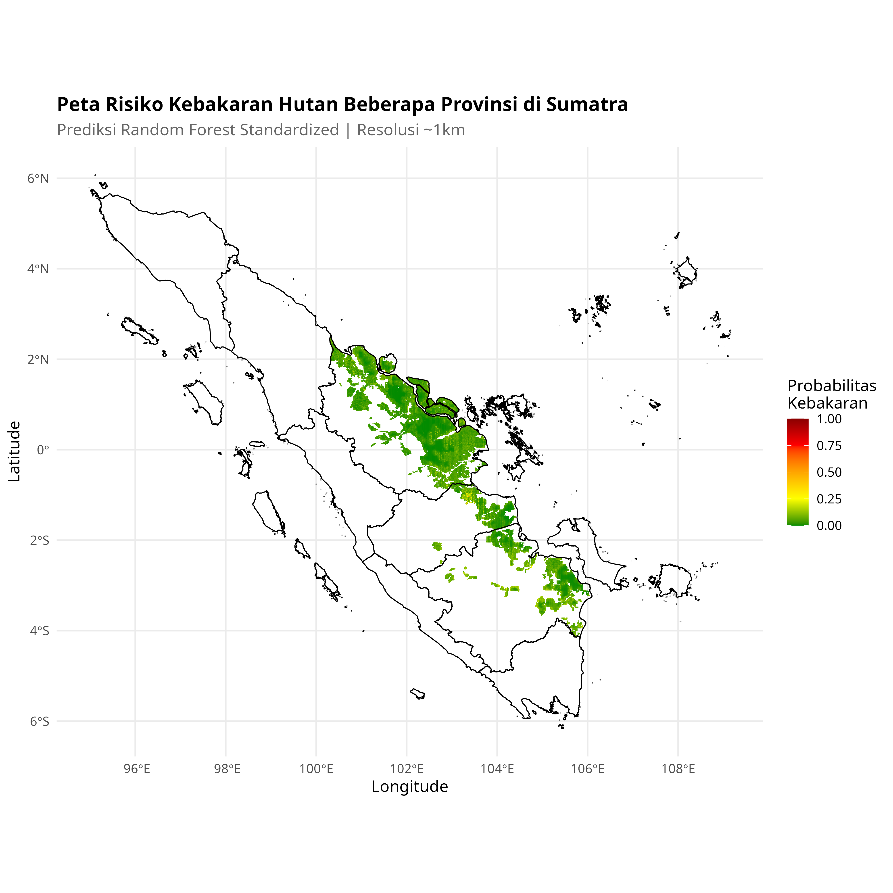

# Wildfire Prediction in Sumatra: DWD vs Random Forest (R)

## 📌 Overview
A comparative machine learning research project in R predicting wildfire occurrences in Sumatra using Distance-Weighted Discrimination (DWD) and Random Forest classifiers with spatial data integration.

## 🛠 Tech Stack
- **Language:** R
- **Libraries:** caret, kernlab, randomForest, sf, ggplot2, leaflet

## 📊 Dataset
Dataset telah melalui proses *scrambling* dan anonimisasi untuk menjaga privasi, tanpa mengubah distribusi statistik utama yang relevan dengan pemodelan.

## 🚀 Methodology
1. Spatial data preprocessing and feature engineering (GeoJSON)
2. 4-scenario experimental design (ASLT/non-ASLT)
3. DWD and Random Forest model training with cross-validation
4. Spatial prediction map generation and comparative analysis

## 📈 Key Results & Metrics
- Best Accuracy (RF): 91.4%
- AUC-ROC (DWD): 0.943
- 4 experimental scenarios evaluated

## 📁 Project Structure
```
Wildfire_Prediction_DWD_RF/
├── README.md
├── code_kebakaran_refactored.R
├── .RData
├── .RDataTmp
├── .Rhistory
├── barplot_akurasi_model.png
├── barplot_perbandingan_4_skenario.png
├── code_kebakaran.R
├── distribusi_data_awal.png
├── hasil_evaluasi_dwd_rbf_aslt.csv
```
