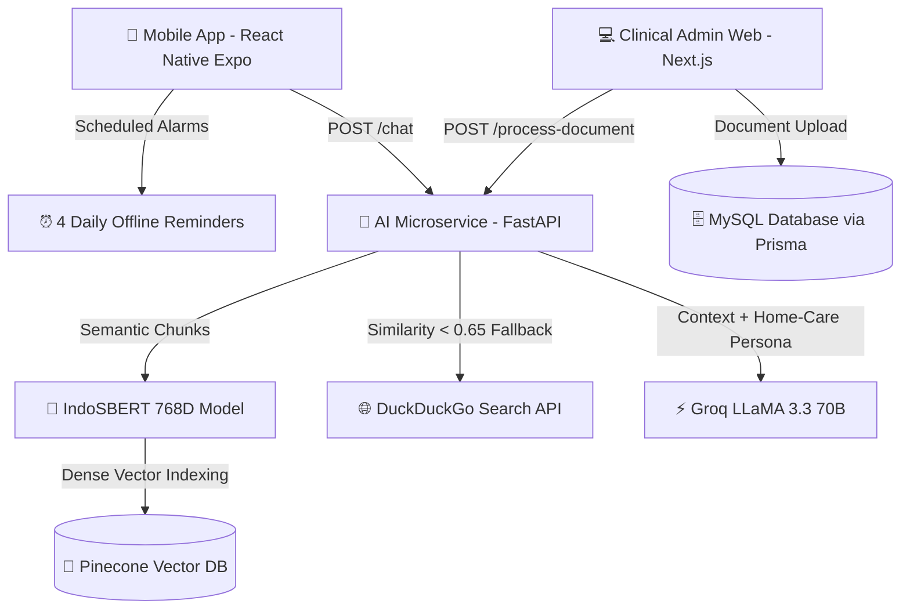

# 🫀 HeartCare AI: Multi-Tier Digital Health Assistant for Heart Failure Management (RAG, Mobile & Admin Web)

## 📖 Overview & Clinical Architecture
Chronic Heart Failure (CHF) is a debilitating cardiovascular condition requiring continuous patient self-monitoring: strict fluid and sodium management, daily morning weighing to detect acute fluid retention (pulmonary edema), and rigorous medication adherence. Elderly patients often struggle to navigate complex discharge instructions or generic online medical advice, leading to preventable hospital readmissions.

**HeartCare AI** delivers a production-grade, multi-tier digital health ecosystem engineered to bridge outpatient clinical oversight with daily home self-care:
1. **Cross-Platform Patient Mobile App (`heartcarebot`)**: A React Native (Expo) application tailored for elderly accessibility, featuring scheduled offline notifications and interactive conversational guidance.
2. **AI & RAG Microservice (`heartcare-ai-service`)**: A high-performance Python FastAPI backend delivering **Retrieval-Augmented Generation (RAG)** grounded in verified clinical guidelines using **IndoSBERT 768D embeddings**, **Pinecone Vector Database**, and **LLaMA 3.3 70B (via Groq)** with automated web search fallback.
3. **Clinical Document Admin Portal (`heartcare-admin`)**: A full-stack **Next.js (App Router)** management dashboard allowing cardiologists and nursing staff to upload, parse, and vector-index medical reference documents in real time.

---

## 🛠️ Multi-Tier Architecture & Technology Stack



### Module Stack Specifications:
- **Patient Mobile App (`heartcarebot`)**:
  - React Native (Expo SDK 57), TypeScript, Expo Router, Expo Notifications.
  - Elderly-optimized UI/UX (high-contrast WCAG-compliant colors, large typography $>18\text{px}$, spacious touch targets).
  - 4 offline daily scheduled notifications (08:00 AM Weight Check; 08:00 AM, 01:00 PM, 08:00 PM Medication Reminders).
- **AI & RAG Microservice (`heartcare-ai-service`)**:
  - Python 3.11, FastAPI, Uvicorn, LangChain Text Splitters.
  - Embedding Engine: IndoSBERT (`firqaaa/indo-sentence-bert-base`, 768 dimensions).
  - Retrieval & Generation: Pinecone Vector Database, DuckDuckGo Search fallback, Groq LLaMA 3.3 70B / OpenAI.
- **Admin Management Portal (`heartcare-admin`)**:
  - Next.js 14 (App Router), React, Tailwind CSS, Prisma ORM, MySQL.
  - Live document processing tracking (`PENDING` $\rightarrow$ `PROCESSING` $\rightarrow$ `INDEXED` / `FAILED`).

---

## 🔄 Methodology & Intelligent Retrieval Pipeline

1. **Dual-Layer Retrieval Architecture**:
   - Ingests patient queries via `POST /chat` and converts them into 768-dimensional dense vectors using IndoSBERT.
   - Queries Pinecone Vector DB with cosine similarity metrics.
   - **Relevance Gating**: If top retrieved chunk similarity exceeds $\ge 0.65$, the answer is synthesized strictly from validated clinical guidelines with citation tags (📚 *Pedoman Klinis*).
   - If similarity drops $< 0.65$ (out-of-knowledge query), the system automatically triggers a DuckDuckGo Search fallback (🌐 *Pencarian Web Terverifikasi*).
2. **Clinical Persona Guardrails ("Home-Care First")**:
   - The LLM prompt engineering strictly enforces non-diagnostic, home-care recommendations (fluid intake, sleeping elevation, salt limits) while automatically triggering emergency warning flags when red-flag symptoms (severe chest pain, acute dyspnea) are detected.

---

## 🚀 How to Run Locally

### 1. Database Setup
Ensure MySQL is running and create the schema:
```sql
CREATE DATABASE IF NOT EXISTS heartcare_db;
```

### 2. Launch AI Microservice (`heartcare-ai-service`)
```bash
cd heartcare-ai-service
python -m venv venv
venv\Scripts\activate  # Windows
pip install -r requirements.txt
uvicorn app.main:app --reload --port 8000
```

### 3. Launch Admin Web Panel (`heartcare-admin`)
```bash
cd heartcare-admin
npm install
npx prisma db push
npm run dev
# Access portal at http://localhost:3000
```

### 4. Launch Mobile Application (`heartcarebot`)
```bash
cd heartcarebot
npm install
npx expo start
# Scan QR code with Expo Go on Android / iOS
```

---

## 🖼️ System Interface & Mobile App Preview

