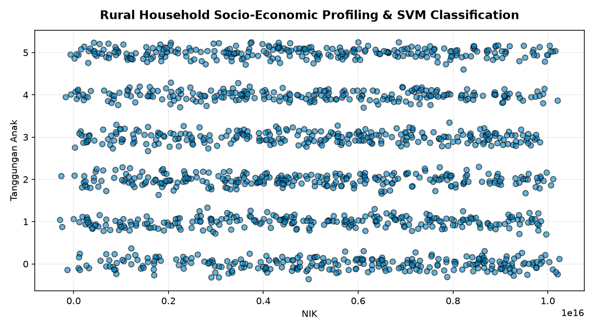

# 🏛️ Municipal Socio-Economic Welfare & Poverty Classification System: CodeIgniter MVC & Support Vector Machine

## 📖 Overview & Public Governance Value
Transparent and equitable distribution of government social safety-net assistance (*Bantuan Sosial / BLT*) in rural municipal administrations is frequently hindered by subjective manual assessments, outdated census registries, and community disputes over eligibility favoritism. Village administrative officers (such as in *Desa Taraju*, West Java) require an automated, objective Decision Support System (DSS) that standardizes household living standards into quantifiable socio-economic poverty tiers.

This project delivers a full-stack **Municipal Welfare Management Web Application** engineered with the **PHP CodeIgniter Model-View-Controller (MVC) Architecture**, integrated directly with an intelligent **Support Vector Machine (SVM)** machine learning classifier. The system automates citizen welfare eligibility scoring based on multi-criteria dwelling assets, dependents, and income indicators, storing verified classification logs into a centralized **MySQL** relational database.

---

## 🛠️ Full-Stack Architecture & Technology Stack
- **Web Backend & Application Framework**: PHP 7.4/8.x, CodeIgniter 3 (MVC Architecture).
  - Controller: `Klasifikasi.php` (form validation, cURL API integration).
  - Model: `Klasifikasi_model.php` (database operations, classification logging).
- **Relational Database**: MySQL / MariaDB (`db_penduduk_svm.sql`).
- **Machine Learning Inference Engine**: Python, Scikit-Learn Support Vector Machine kernel (`poverty_classification_svm.ipynb`).
- **Data Foundation**: Rural demographic and dwelling asset census (`dummy_penduduk_desa_taraju.csv`).

---

## 🔄 Methodology & Full-Stack System Flow

```
Village Admin Portal (CodeIgniter View)
                 │
                 ▼
  Form Submission: Household Multi-Criteria Attributes
  ├── Demographics: Occupation, Education, School-Age Children
  └── Dwelling Assets: Floor Material, Wall Type, Power Grid, Water Source
                 │
                 ▼
  CodeIgniter Controller (Klasifikasi.php)
  ├── Server-Side Input Validation
  └── JSON Payload Serialization
                 │
                 ▼
  REST API Call (cURL POST to ML Inference Service)
                 │
                 ▼
  Python Scikit-Learn SVM Model
  └── Computes Optimal Hyperplane Classification
                 │
                 ▼
  Classification Response Received by Controller
                 │
                 ▼
  Database Persistence (Klasifikasi_model.php -> MySQL)
  └── Writes Verified Status into Audit Log Table
                 │
                 ▼
  Updated Welfare Status Dashboard Displayed to Officer
```

---

## 📊 Key System Features & Criteria Evaluation
- **Standardized Multi-Criteria Scoring**: Replaces subjective assessments with 9 verified socio-economic indicators aligned with national welfare guidelines:
  - *Dwelling Physical Assets*: Dirt/bamboo vs. concrete flooring, unreinforced timber vs. masonry walls.
  - *Utilities Access*: Grid capacity (450VA subsidized vs. 900VA+ standard) and protected vs. unprotected water supply.
  - *Household Burden*: Number of dependent school-age children and employment stability.
- **Audit-Proof Decision History**: The `riwayat_klasifikasi` database table archives every scoring event with timestamps, providing verifiable records for municipal public audits.
- **Decoupled Architecture**: CodeIgniter communicates with the Python ML microservice over standard REST/JSON endpoints via cURL, allowing independent scaling of the web portal and the ML inference backend.

---

## 🚀 How to Run & Deploy Locally

### 1. Database Configuration
Import the database schema into your local MySQL server (e.g., via phpMyAdmin or MySQL CLI):
```bash
mysql -u root -p -e "CREATE DATABASE db_penduduk_svm;"
mysql -u root -p db_penduduk_svm < db_penduduk_svm.sql
```

### 2. Configure CodeIgniter Application
Place the project inside your web server directory (e.g., `C:\xampp\htdocs\poverty_system`). Update `application/config/database.php` with your local database credentials:
```php
'hostname' => 'localhost',
'username' => 'root',
'password' => '',
'database' => 'db_penduduk_svm',
```

### 3. Launch the Web Application
Start Apache in the XAMPP Control Panel and navigate to `http://localhost/poverty_system/index.php/klasifikasi` in your web browser.

---

## 🖼️ Socio-Economic Assessment & System Preview

