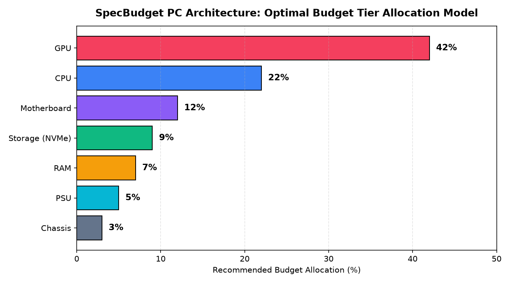

# ⚙️ SpecBudget: Interactive Client-Side PC Hardware Configuration & Budget Allocation Planner

## 📖 Overview & Systems Engineering Context
Building a custom personal computer requires balancing interconnected technical constraints: avoiding hardware bottlenecks, calculating total system Thermal Design Power (TDP) to specify adequate power supplies, verifying component dimensions, and ensuring balanced budgetary distribution. Novice and enthusiast builders frequently make suboptimal allocations—such as pairing an expensive enthusiast processor with an underpowered budget graphics card, or purchasing an inadequate wattage power supply unit (PSU).

**SpecBudget** is an interactive, client-side web application engineered to simplify custom PC planning. Built entirely with **Semantic HTML5, Modern Vanilla CSS (Flexbox & CSS Grid), and Modular ES6+ JavaScript**, the application delivers real-time reactive budget tracking, automated system wattage estimation, component cost breakdowns, and persistent user session management without requiring heavy frontend framework overhead.

---

## 🛠️ Architecture & Technology Stack
- **Frontend Core**: Semantic HTML5, Vanilla JavaScript (ES6+).
- **Styling & Visual Design**: Vanilla CSS3 utilizing CSS Custom Properties (CSS variables), responsive Flexbox and Grid layouts, and subtle glassmorphic surface elevations (`css/style.css`).
- **State Management & Local Persistence**: Web Storage API (`localStorage`) preserving active hardware builds, budget allocations, and client authentication sessions across browser refreshes.
- **Vector Assets**: Custom hardware component SVG iconography (`assets/cpu.svg`, `gpu.svg`, `ram.svg`, `storage.svg`, `psu.svg`, `mobo.svg`).
- **Application Page Structure**:
  - `index.html`: Product landing page, feature highlights, and builder guides.
  - `calculate.html`: Interactive component selection matrix, real-time cost calculator, and wattage estimator.
  - `login.html` & `register.html`: Client-side authentication and session handling.

---

## 🔄 Methodology & Reactive Client-Side Pipeline

```
User Interactions (Dropdowns, Sliders, Checkboxes)
                         │
                         ▼
       Client-Side Reactive Event Bus (calculate.html)
  ┌──────────────────────┼──────────────────────┐
  ▼                      ▼                      ▼
Dynamic Component   TDP Power Budget       Budget Allocation
Selection Engine    Calculation Engine     Analysis Engine
├── Unit Price      ├── Base CPU & GPU     ├── Total Build Cost
│   Aggregation         TDP Aggregation    ├── Over-Budget Warnings
└── Hardware Tier   └── +20% Safety Cap    └── Component Ratio
    Compatibility       PSU Recommendation     Percentage Meters
  │                      │                      │
  └──────────────────────┼──────────────────────┘
                         ▼
        Real-Time DOM State Update & LocalStorage Sync
```

---

## 📊 Key System Features & Mathematical Allocation Engine

### 1. Optimal Budget Allocation Model
- The application benchmarks total selected component expenditures against the builder's declared budget ceiling.
- Recommends an empirical gaming PC budget distribution model:
  - **GPU**: $40\% - 45\%$ of total budget.
  - **CPU**: $20\% - 25\%$ of total budget.
  - **Motherboard & RAM**: $15\% - 20\%$ combined.
  - **Storage, PSU & Case**: Remaining $15\% - 20\%$.

### 2. Automated Power Draw & PSU Calculator
- Dynamically sums peak component wattage draw:
  $$\text{Recommended PSU Wattage} = \left( \text{TDP}_{\text{CPU}} + \text{TDP}_{\text{GPU}} + \text{TDP}_{\text{System Overhead}} \right) \times 1.25$$
- The 25% overhead ensures power supply efficiency curves operate within optimal 80-Plus load zones (50–70% capacity) and safely absorbs transient power spikes.

### 3. Lightweight & Zero-Dependency Execution
- Requires zero bundlers (Webpack/Vite), Node.js runtimes, or external CDNs. The entire application runs natively in any standard web browser.

---

## 🚀 How to Run Locally

### Option 1: Direct Browser Launch
Simply navigate to the project directory and double-click `index.html` to launch the application directly in Google Chrome, Mozilla Firefox, or Microsoft Edge.

### Option 2: Local HTTP Server (Python)
To test in a standard HTTP server environment:
```bash
python -m http.server 8080
```
Open `http://localhost:8080` in your web browser.

---

## 🖼️ Application Interface & Budget Breakdown

